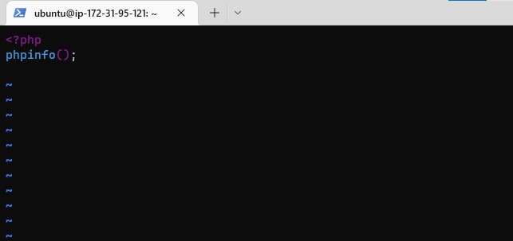

# Deploying a LAMP (Linux,Apache,Mysql,PhP) Stack application (LAMP STACK) on AWS Cloud

 In this project, I learnt how to serve PHP websites and applications to website visitors, using LAMP Stack which make use a Linux server, Apache, an open source software for serving web pages; as web server and MySQL as database management system.

## First Step: Launch EC2 instance on AWS cloud and Install Apache & update the server
1. Lauch a Linux EC2 instance on AWS Cloud.

2. Update packages in package manager.

3. Run command (sudo apt install apache2) for apache installation.

4. Verify successful installtion (run sudo systemctl status apache2).

5. run command (curl http://127.0.0.1:80 or http://localhost:80) to Check how to access the webserver locally.

6. Add inbound rule for HTTP on AWS instance.

7. Access webserver(via  public IP) via Browser.

Second Step: Installed mysql server
1. Run installation command.

2. Test login.

Thrid Step: Installing PHP
1. Run sudo apt install php libapache2-mod-php php-mysql to Install PHP, PHP-mysql and libapache2-mod-php.

2. check php version (php -v)

Forth Step: Setup Apache Virtual Host for websites
1. Create new domaian directory -projectlamp

2. Assign directory ownership to current root user.

3. Create and open a new configuration file (for projectlamp) in Apache’s sites-available directory.

4. Show the new file in the sites-available directory.

5. Enabled the new virtual host (with sudo a2ensite projectlamp
)

6. Disable default apache website, ensure config file is void of syntax error and reload Apache to save changes.

7. Create index.html file in the new active web root.

8. Open index.html in a browser with IP and DNS

Fifth Step: Enable PHP on the website
1. Since Index.html takes precidence over index.php by default then change precidence.

2. Create new file index.php in custom web root folder(with vim /var/www/projectlamp/index.php)

3. Refresh url to check that php is installed and working.

4. Remove index.php to protect server sensitive information.

