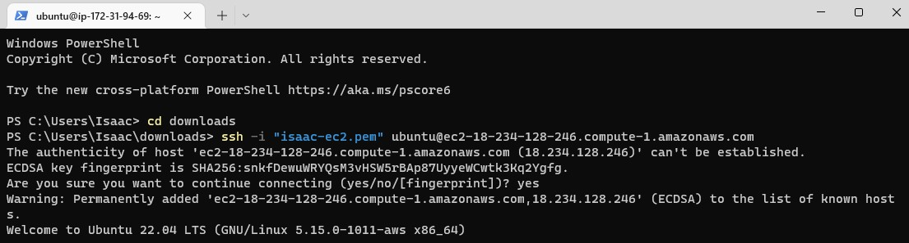
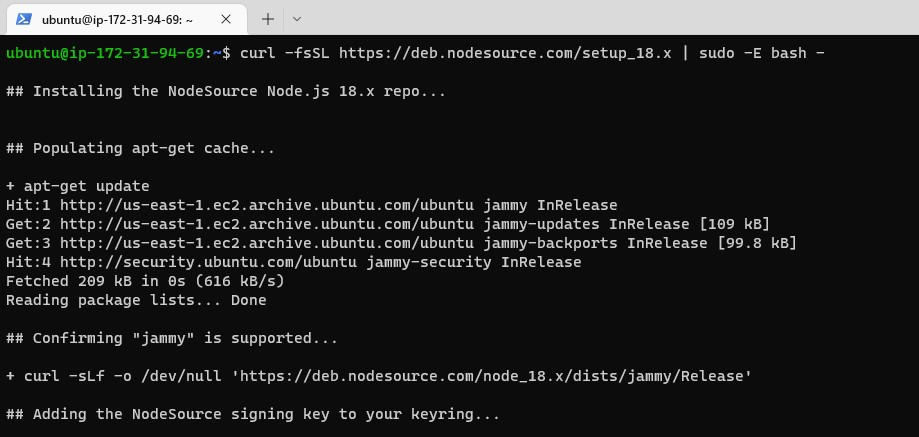
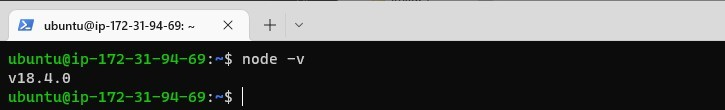
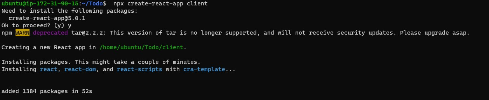
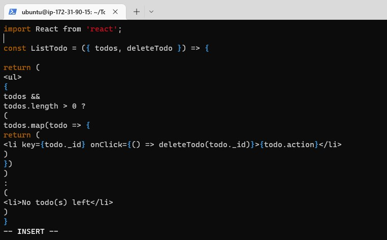
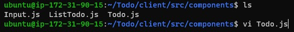

# Depoying Application on AWS cloud using MERN(MongoDB, Express, Angular, and Node) Stack 
- In this Project I created a simple To-Do and deployed it using MERN stack. 
- The frontend application uses React.js that communicates with the backend application written using Expressjs. 
- Mongodb backend is used for storing tasks in a database.

## First Step: Backend Configuration
1. Create an EC2 instance server in AWS.

2. Connect to the instance from the terminal and update ubuntu OS.

3. Upgrade ubuntu OS.

4. Run command (curl -fsSL https://deb.nodesource.com/setup_18.x | sudo -E bash -
) to get the location of Node.js software from Ubuntu repositories.

5. Install Node.js and NPM (with the command- sudo apt-get install -y nodejs).

6. Verify that Node.js is installed (with the command- node -v).

7. Create a new directory for the Todo project and verify that the directory is created.

8. Change current directory to Todo and run the command 'npm init' to initialise the project, so that a new file named package.json will be created.

9. Run - ls command to check that package.json has been created.

## Second Step: Install ExpressJs and create the Routes directory.
1. Install express using npm.

2. Create a index.js (using-touch index.js) and run ls to confirm that the file has been created.

3. Run command (npm install dotenv) to install the dotenv module.

4. Open the index.js file (using vim index.js). Copy and insert the required code into the file.

5. Test if server works. Run command (node index.js) to start server and see if it is runing on port 5000.

6. Add inbound rule for port 5000 on EC2 instance in AWS.

7. Access server via browser using public IP or DNS followed by port 5000.

8. Access server via browser using public IP or DNS followed by port 5000.

9. Each task on the app (i.e create task, display list of tasks and delete a complete task) will be associated with endpoints.Create a folder named routes that will define various endpoints that the To-do app will depend on. Change to that directory.

10. Create a file api.js (using touch api.js) and open it with vim.

11. Copy and past code into the file.

## Third Step: Create Models directory.

1. Install mongoose which is a Node.js package that makes working with mongodb easier.

2. Create a new folder models, change into that directory, create a file todo.js, open the file(mkdir models && cd models && touch todo.js) and paste the necessary code. save and exit.

3. In routes directory, open api.js with vim api.js, delete the code inside the file with :%d command and paste the required code into it then save and exit.

## Fourth step: Setup MongoDB Database
1. Make use of mLab by signing up for a shared clusters free account and create database.

2. Create a .env to access environment variables in the Todo directory and open the file. insert the connection string into the file, with the database user credentials. Then save and exit.

3. Update the content of index.js to reflect the use of .env so that Node.js can connect to the database. Then start the server.

3b. Databased connected successfully. Backend successfully configured.

## Fifth step: Testing Backend Code without Frontend using RESTful API.
1. Download and install postman App on local machine.

2. Open your Postman, create a POST request to the API with header key set as Content-Type and value as application/json. This is to confirm that the frontend can communicated with the backend.

3. Create and send a POST request - the data as follows - {"action":"Finish Project 1 and 2" }

4. Send a GET request to test fetching data from the database.

5. Send a DELETE request by passing the data id value with the url.

## Fifth Step: FontEnd Creation - creating a user interface for a Web client (browser) to interact with the application via API. 
1. Run - create-react-app client command  to start with the creation of the frontend for the To-do app. This creates REACT code in the clients folder.

2. Before runing the REACT app, install dependencies (npm install concurrently --save-dev,npm install nodemon --save-dev).

3. Update the script string section of package.json file in the Todo folder.

4. Configure Proxy in package.json by Changing directory to ‘client’. Then Open the package.json file and Add the key value pair in the package.json file "proxy": "http://localhost:5000" to make easier to access the application from the browser.

5. From the Todo directory, do npm run dev.

6. The app start running on localhost:3000. Add a new security inbound rule for TCP port 3000 on EC2 instance in order to access the application from the Internet.

7. Create the REACT Components (two stateful components and one stateless) for the Todo app. Change to the client directory. Then move to the src folder and create components folder. Then change directory to the components folder and create three files (Input.js ListTodo.js Todo.js).

8. Open Input.js file and insert the required code into the content of the file.

9. Install Axios (with run yarn add axios or npm install axios) in client directory to make use of Axios Promise based HTTP client for the browser and node.js.

10. From the src in the components directory (cd src/components),  open the ListTodo.js file and insert the required code into the file

11. In the components directory, open the Todo.js file and write the required code.

12. Make little adjustment to the react code by deleting the logo and adjust the App.js file. Change directory to src and open the App.js file then replace with the required lines of code.

13. Open the App.css file in the src directory and replace with the required code. Save and exit.

14. In the src directory,  open the index.css file  and replace with the required code. Save and exit.

15. Go to the Todo directory and run the command - npm run dev. The To-Do app is now fully functional with the following functionality: creating a task, deleting a task and viewing all your tasks.

