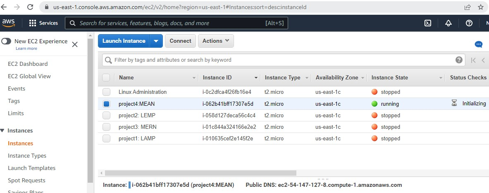
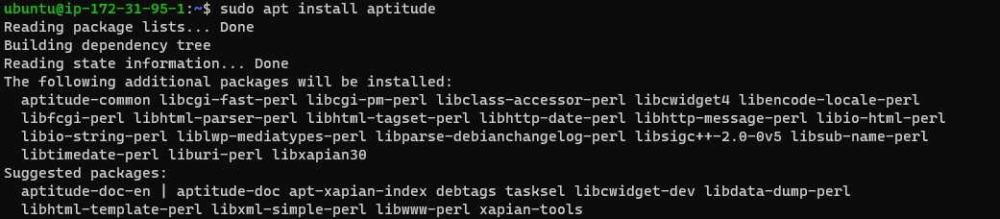

# Depoying a Book Register Application on AWS cloud using MERN (MongoDB, Express, Angular, and Node) Stack 

In this project I implemented a simple Book Register applicatiton using MEAN stack deployed on EC2 AWS cloud.

## First Step: Backend configuration & Install NodeJS
1. Create and launch an EC2 instance server in AWS.

2. Connect to the instance from the terminal and update ubuntu OS.

3. Upgrade ubuntu OS.

4. Added required Certificates (with sudo apt -y install curl dirmngr apt-transport-https lsb-release ca-certificates and curl -sL https://deb.nodesource.com/setup_14.x | sudo -E bash  -).

5. Install NodeJS.
A JavaScript runtime built on Chrome’s V8 JavaScript engine. It will be used to set up the Express routes and AngularJS controllers. 

## Second Step: Install MongoDB

1. To install MongoDB, first add the apt key and then add sources for mongodb to sources.list.

2. Install the MongoDB binary (MongoDB stores data in flexible, JSON-like documents.) It will be used to hold book records that contain book name, isbn number, author, and number of pages.

3. Start the MongoDB server and verify that it is running.

4. Install npm – Node package manager. Encountered an issue while installing npm.Install aptitude to resolve the conflict. Then install npm with aptitude.

5. Install body-parser package to help in processing JSON files passed in requests to the server.

6. Create a folder named ‘Books’ and in the Books directory, initialize npm project which assist in creating a package.json file.

7. Create a server.js filein thesame directory and edit the required content accordingly.

## Third Step: Install Express and set up routes to the server.

1. Install Express and Mongoose (with sudo npm install express mongoose) to have a schema for the database to store data of the book register app.

2. Create a folder named apps in ‘Books’ folder. Move into the apps folder and create routes.js file. Edit the content of routes.js accordingly.

3. In the ‘apps’ folder, create a folder named models and create a file named book.js in the folder. Edit the content of book.js accordingly.

## Forth Step: Access the routes with AngularJS

1. Change the directory back to ‘Books’ then create a folder named public and add a file named script.js. Edit the content script.js by pasting the required code (controller configuration defined).

2. In public folder, create a file named index.html and edit the content by pasting the required code into the the file.

3. Change the directory back to Books and start the server.

4. Launch a separate SSH console to test what curl command returns locally.

5. For browser access, set open TCP port 3300 in the EC2 instance in  AWS Web Console.

6. To obtain EC2 intance public DNS or public IP, at the terminal, run curl -s http://169.254.169.254/latest/meta-data/public-ipv4 for Public IP address or curl -s http://169.254.169.254/latest/meta-data/public-hostname for Public DNS name. Then add port 3300 and access the app via the browser.
