# Client Server Architecture Implementation

In this project, I demostrated remote connection between an AWS EC2 client instance and an AWS EC2 server instance by implementing a Client-Server Architecture using MySQL Database Relational Database Management System (DBMS).

## As follows:

1. Launch two EC2 linux ubuntu servers on AWS cloud. Rename one as MYSQL-SERVER and the other as MYSQL-CLIENT.

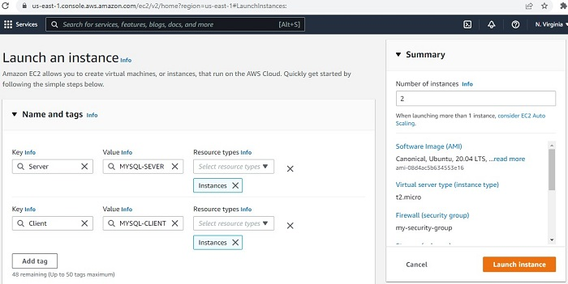
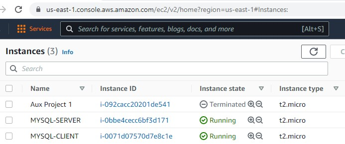

2. Connect and rename both instances from the terminal (with sudo hostnamectl set-hostname mysql-server or mysql-client) for easy identification. Exit and try to reconnect again.

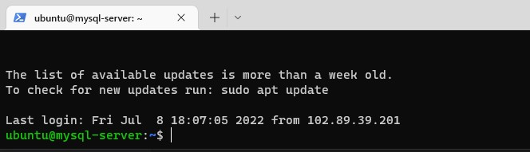
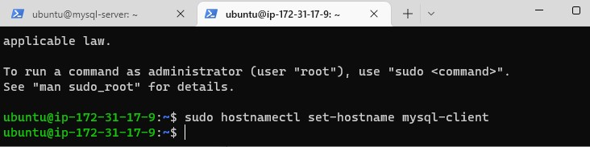
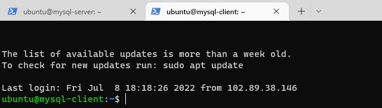

3. From the terminal, update and upgrade both the server and client with sudo apt update -y.

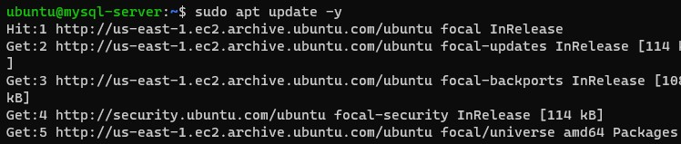
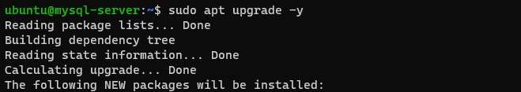
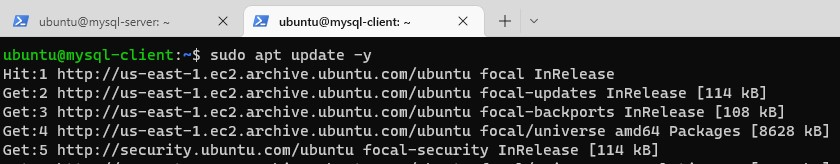

4. Install and enable mysql server on mysql server instance (with sudo apt install mysql-server -y then enable mysql service with sudo systemctl enable mysql). Install on client instance (with sudo apt install mysql-client -y).
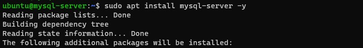
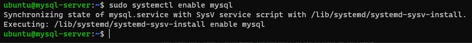

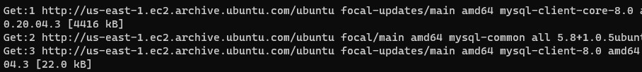

5. To allow communication between server and client, add the private IP of the mysql client to port 3306 (mysql server listening port) in the inbound rule of mysql server security group on AWS cloud).

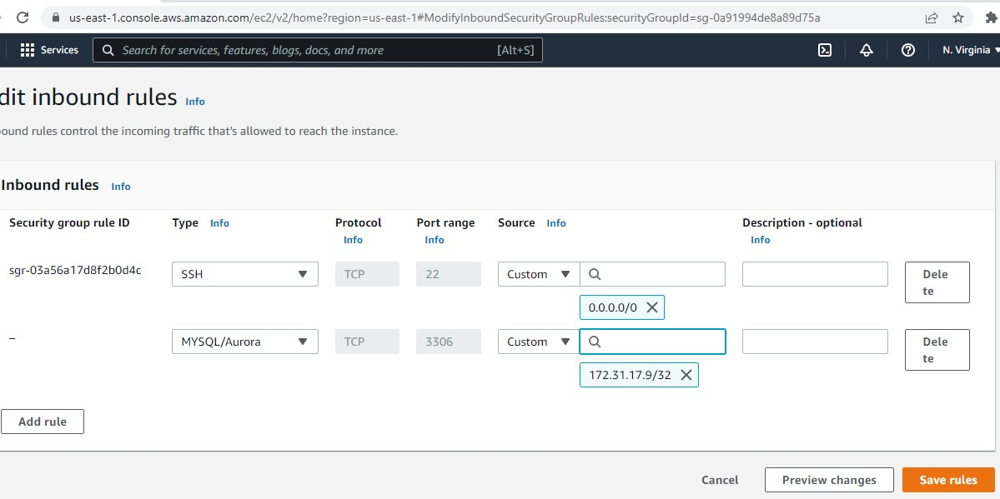

6. Secure mysql server with password. (First run ALTER USER 'root'@'localhost' IDENTIFIED WITH mysql_native_password by 'password'; then run mysql_secure_installation. You can change the password and apply changes that will protect the database). 
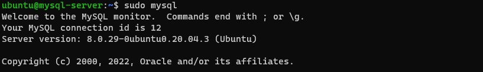
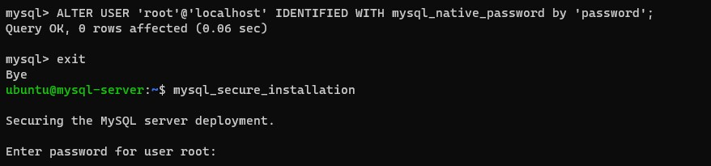
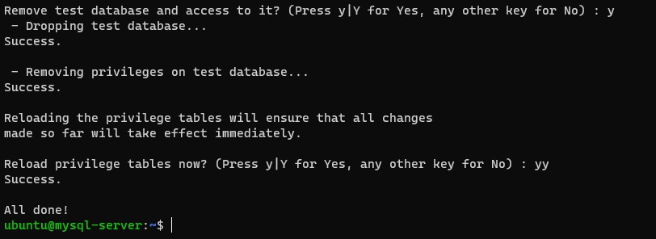

7. Configure mysql server to allow connections from remote hosts (run command: sudo vi /etc/mysql/mysql.conf.d/mysqld.cnf and change the bind-address from 127.0.0.1 to 0.0.0.0).

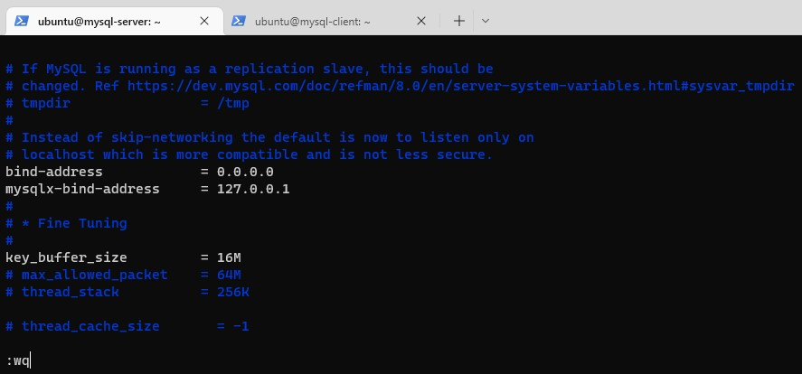

8. Create a database - test_db. First login with mysql -uroot -p and enter your password. Then run the script as follows:
CREATE USER 'remote_user'@'%' IDENTIFIED WITH mysql_native_password BY 'password';  
CREATE DATABASE test_db;
GRANT ALL ON test_db.* TO 'remote_user'@'%';
FLUSH PRIVILEDES; 
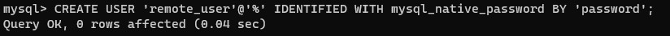

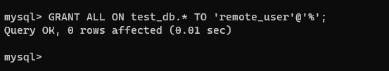
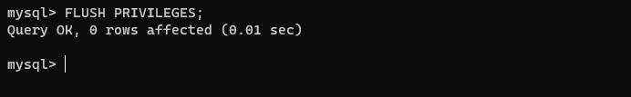

9. Check that the database has been created and restart mysql server (with sudo systemctl restart myssql).

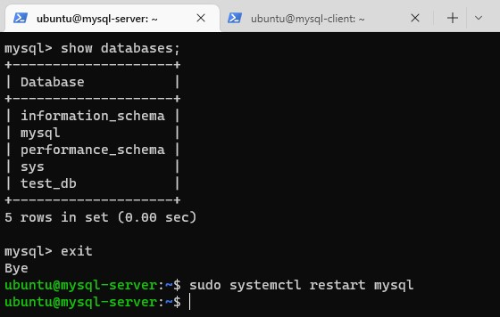

10. Switch to mysql client terminal and connect remotely to mysql server Database engine without using SSH using a mysql utility.
(sudo mysql -u remote_user -h (private ip address of MySQL server) -p (since both the client and server are on thesame network). Then run show databases;). The test_db ealier created on mysql server is displayed successfully at the terminal of mysql client.
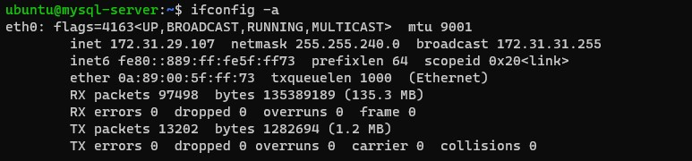
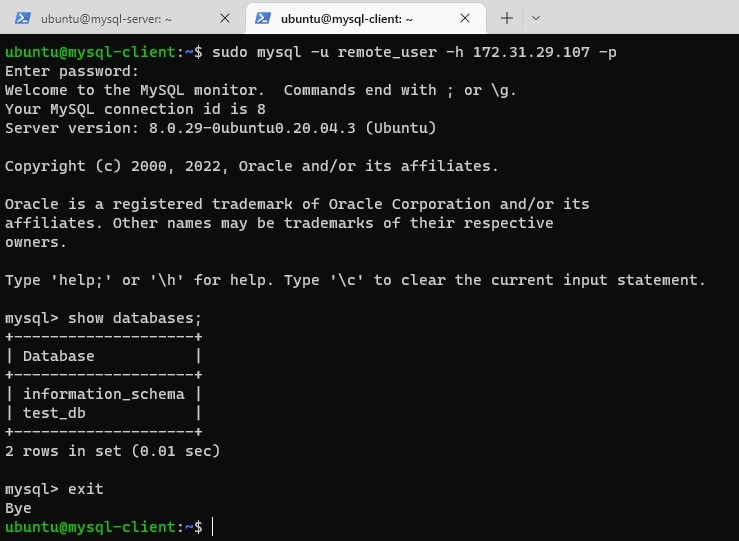

