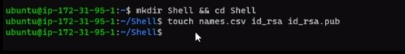

        
## AUX PROJECT1: Onboarding of 20 users using Shell Scripting

1. Launch an EC2 t2 micro ubuntu Linux instance on AWS Cloud.

2. Connect to the instance from the terminal.

3. Create the project folder - Shell and move into the directory.

4. Create files names.csv, id_rsa, and id_rsa.pub thesame directory.

5. Edit the content of id_rsa file by copying and pasting the private key into the file. Save and exit.

6. Edit the content of id_rsa.pub file by copying and pasting the public key into the file. Save and exit.

7. Edit the content of names.csv file by adding the first names of the users to be onboarded to the system. Save and exit.

8. Create the developers group that the users will be added unto.

9. Create onboard.sh file that the contain the script and paste the shell script to create the users into the file. Save and exit.

10. Make the file executable by runing chmod +x onboard.sh.

11. One of the conditions in the script is that only an admin user can run the script. So run - sudo su to elevate to root user profile and then run the file with ./onboard.sh. 

12. The 20 users are automatically created with the appropriate permission, authorised keys saved in the ssh folder in individual home directories, and password expiry information change.

13. Verify that the users have been created.

14. Check the home directory of one of the users and verify the content of the authorized key file. Exit from the terminal.

15. Test using one or two user to connect to the server using the private key and the public key. Switch to a linux machine and create a id_rsa.pem file containing the private key.

15. Run chmod 400 on id_rsa.pem to change the mode of the file so that the content can be private and acceptable by the AWS server. Then in thesame directory, try to connect to the server using the first names of the already created users. User connected successfully.

15. Test again with another user, using thesame id_rsa.pem file to connect to the server. User connected successfully.

Click [here](https://drive.google.com/file/d/1mFpA3QbcExKJv6KX2fYoyBhnueBYbOoN/view) to see brief demo video.