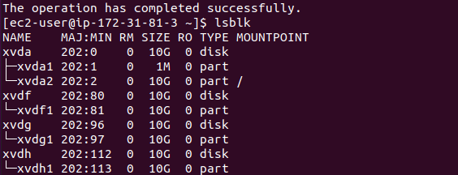
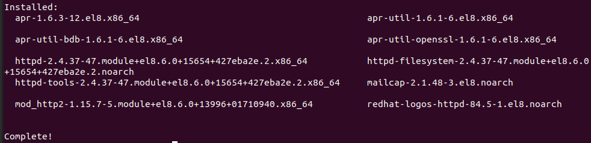

# DevOps-Tooling-Website-solution

I setup a Three-Tier architecture using AWS infrastructure and deployed a DevOps tooling website solution.
- `The architectire comprises of a client, 2 linux Redhat webserver to serve the tooling app solution  to users, 1 linux Redhat NFS server as the storage server and an Ubuntu linux Database server as a shared file storage.`
- `I attached three volume disks to the NFS server and worked with some storage and disk management utlities that ensures that the disks used to store files on the Linux server are adequately partitioned and managed.`
- `I connected the webservers to the  nfs server and the database server so that all of the servers communicate with each other in replicating files accross the network, (so that if one of the webservers is offline the other servers will continue to serve content to clients) after which I deployed a DevOps tooling website solution.`

## DevOps Tooling Website Solution

First Step - Prepare the needed Servers starting with NFS server.

1. Launch 4 EC2 instances on AWS cloud. 2 webservers, 1 NFS server (with RHEL 8 OS), and 1 database server (ubuntu 20.4+ mysql).

2. On the NFS server in AWS, create 3x 10gb ebs logical volumes in thesame AZ.  and attach it to the server. From the NFS server terminal, perform the following: 
- *List available attached blocks*: Run `lsblk`.
- *Create a single partition on each of the disks using gdisk utility:* 
    - Run `sudo gdisk /dev/xvdf`. 
    - Run `sudo gdisk /dev/xvdg`. 
    - Run `sudo gdisk /dev/xvdh`.

- *Install lvm package:* 
    - `sudo yum install lvm2 -y`.
- *To check for available partitions:* 
    - Run `sudo lvmdiskscan`.
- *Create physical volumes to be used by lvm:* 
    - Run `sudo pvcreate /dev/xvdf1 /dev/xvdg1 /dev/xvdh1`

- *Check that the pvs have been added:* 
    - Run `sudo pvs`.
- *Create volume group (as a single storage space):*
    - Run `sudo vgcreate webdata-vg /dev/xvdf1 /dev/xvdg1 /dev/xvdh1`
- *Check that the volume group has been created:* 
    - Run `sudo vgs`
- *Create 3 logical volumes - lv-apps, lv-logs and lv-opt:*
    - Run `sudo lvcreate -n lv-apps -L 9G webdata-vg`
    - Run `sudo lvcreate -n lv-logs -L 9G webdata-vg`
    - Run `sudo lvcreate -n lv-opt -L 9G webdata-vg`

- *Format disks as xfs instead of ext4:*
    - Run `sudo mkfs -t xfs /dev/webdata-vg/lv-apps`
    - Run `sudo mkfs -t xfs /dev/webdata-vg/lv-logs`
    - Run `sudo mkfs -t xfs /dev/webdata-vg/lv-opt`

- *Check the entire setup:*
    - Run `sudo vgdisplay -v #view complete setup -VG, PV, and LV`

3. Create mount points /apps, /logs and /opt. 
    - Run `sudo mkdir /mnt/apps /mnt/logs /mnt/opt`
- Mount them accordingly.
    - Run `sudo mount /dev/webdata-vg/lv-apps /mnt/apps`
    - Run `sudo mount /dev/webdata-vg/lv-logs /mnt/logs` 
    - Run `sudo mount /dev/webdata-vg/lv-opt /mnt/opt`

4. Install NFS server, configure it to start on reboot and make sure it is up and running.

- Run `sudo yum update -y`
- Run `sudo yum install nfs-utils -y`
- Run `sudo systemctl start nfs-server.service`
- Run `sudo systemctl enable nfs-server.service`
- Run `sudo systemctl status nfs-server.service`

5. For a successful client connection there is need to export the mounts for webservers' subnet cidr. Obtain the subnet cidr from the subnet link of the networking tab on the EC2 details on AWS consile (For simplicity, you will install all three servers inside thesame subnet. However, in production setup you might want to seperate each tier inside its own subnet for higher level of security.)

- Set up permission that will allow the webservers to read, write and execute files on NFS:
    - Run `sudo chown -R nobody: /mnt/apps`
    - Run `sudo chown -R nobody: /mnt/logs`
    - Run `sudo chown -R nobody: /mnt/opt`
    - Run `sudo chmod -R 777 /mnt/apps`
    - Run `sudo chmod -R 777 /mnt/logs`
    - Run `sudo chmod -R 777 /mnt/opt`
    - Run `sudo systemctl restart nfs-server.service`
    - Run `sudo systemctl status nfs-server.service`

- Configure access to NFS for clients within the same subnet 
(example of Subnet CIDR – 172.31.32.0/20 ):Edit exports file.

    - Run `sudo vi /etc/exports` and add the following:
        -   /mnt/apps *(webserver1 subnet cidr IP)*(rw,sync,no_all_squash,no_root_squash).
        -   /mnt/logs *(webserver1 subnet cidr IP)*(rw,sync,no_all_squash,no_root_squash).
        -   /mnt/opt *(webserver1 subnet cidr IP)*(rw,sync,no_all_squash,no_root_squash).
        -   Esc + :wq!
    - In order for the the webservers to see the setting they connect:
        -   Run `sudo exportfs -arv`

7. Check which port is used by NFS and open it using Security Groups (add new inbound rule):
    - Run `rpcinfo -p | grep nfs`
    - In order for NFS server to be accessible from your client, you must also open following ports in the inboud rule of nfs server.
        - On EC2 instance at AWS, open ports TCP: 111, TCP: 2049, UDP: 111, UDP: 2049 and add webserver sub cidr IP.

Second Step — Configure The Database Server

1. Install and configure a MySQL DBMS on the ubuntu to work with remotely with the webserver. From the database terminal:
    - Run `sudo apt update -y`
    - Run `sudo apt install mysql-server -y`

2. Create a database and name it tooling
    - Run `sudo mysql`
    - Run `create database tooling;`

    

3. Create a database user and name it webaccess. Grant permission to webaccess user on tooling database to do anything only from the webservers subnet cidr.
    - Run `create user 'webaccess'@'webserver1 subnet cidr IP' identified by 'password';`
    - Run `grant all privileges on tooling.* to 'webaccess'@'webserver1 subnet cidr IP';`
    - Run `flush privileges;`
    - Run `show databases;`
    - `exit`

Third Step — Prepare the Web Servers.

1. Mount previously created nfs Logical Volume lv-apps to webservers, in the folder where Apache stores files to be served to users (/var/www). As a result, the Web Servers becomes stateless, and the integrity of the data (in the database and on NFS) will be preserved.

- On the three webservers, configure NFS client.
    - Run `sudo yum update -y`
- Install NFS client.
    - Run `sudo yum install nfs-utils nfs4-acl-tools -y`

- Mount /var/www/ and target the NFS server’s export for /apps
    - Run `sudo mkdir /var/www`
    - Run `sudo mount -t nfs -o rw,nosuid <NFS-Server-Private-IP-Address>:/mnt/apps  /var/www`
- Verify that NFS was mounted successfully:
    - Run `df -h`.
    

2. Make sure that the changes will persist on Web Servers for mnt/apps after reboot by editing fstab file.
    - Run `sudo vi /etc/fstab`
    - add as follows `<NFS-Server-Private-IP-Address>:/mnt/apps /var/www nfs defaults 0 0`

3. Install Apache to serve content to users.
    - Run `sudo yum install httpd -y`

4. Install PHP and its dependencies
    - Run `sudo dnf install https://dl.fedoraproject.org/pub/epel/epel-release-latest-8.noarch.rpm -y`
    - Run `sudo dnf install dnf-utils http://rpms.remirepo.net/enterprise/remi-release-8.rpm -y`
    - Run `sudo yum module list`
    - Run `sudo dnf module reset php`
    - Run `sudo dnf module enable php:remi-7.4`
    - Run `sudo dnf install php php-opcache php-gd php-curl php-mysqlnd`
    - Run `sudo systemctl start php-fpm`
    - Run `sudo systemctl enable php-fpm`
    - Run `sudo su` followed by `setsebool -P httpd_execmem 1`
    - Run `sudo systemctl restart httpd`

###  Repeat steps 1-4 above for the another web servers.

5. Verify that Apache files and directories are available on the Web Servers in /var/www and also on the NFS server in /mnt/apps. You can try to create a new file test.txt the directory on one web server and check if the same file is accessible from other Servers.
    - Run `ls /var/www` on webservers &
`ls /mnt/apps` on nfs server.

6. Locate the log folder for Apache on the Web Server and mount it to NFS server’s export for logs. 
Make sure the mount point will persist after reboot.
    - Run `sudo mount -t nfs -o rw,nosuid <NFS-Server-Private-IP-Address>:/mnt/logs  /var/log/httpd`
    - Run `sudo vi /etc/fstab`
    - add as follows `<NFS-Server-Private-IP-Address>:/mnt/logs /var/log/httpd nfs defaults 0 0`

Fourth Step: Deploy the Tooling application to the Web Servers and access the app via browser.

1. Fork the tooling source code from [Dare.io](https://github.com/darey-io/tooling.git)
Deploy the tooling website’s code to the Webserver. Ensure that the html folder 
from the repository is deployed to /var/www/html.
    - INSTALL GIT on webserver
        - Run `sudo yum install git -y` then `git init`
        - followed by `git clone <url from forked darey.io>`

.

        - `ls` to see tooling folder then `cd` into it
    - then move the html folder to /var/www/
        - first - `sudo ls /var/www` 
        - second- `sudo cp -R html/. /var/www/html`
    - compare the contents of both directories.
        - `ls /var/www/html`
        - `ls /tooling/html`

2. Open TCP port 80 on the inbound rule of the Web Servers. Try to access webserver with public IP and check if apache is runing.
- Run `sudo systemctl status httpd`

- Check permissions to  /var/www/html folder and also disable SELinux if error occurs.
    - Run `sudo setenforce 0`
- To make this change permanent – edit the config file.
    - Run `sudo vi /etc/sysconfig/selinux`
    - set SELINUX=disabled then restart httpd.
        - `sudo systemctl restart httpd`
        - `sudo systemctl status httpd`

4. Configure the Web Servers to work with a single MySQL database. Update the website’s configuration to connect to the database. Edit functions.php.
    - Run `sudo vi /var/www/html/functions.php`. 
    - then edit accordingly.//connect to $db('private ip address for DB', admin='webaccess' , admin='password' , tooling).

5. Still on webservers. Install mysql client on webservers
    - Run `sudo yum install mysql -y` or
    - Run `sudo dnf -y install @mysql`

6. On Database server EC2 settings at AWS, add mysql/arora to the inbound rule and add webserver sub cidr IP. Also edit mysql bind address via the terminal.
    - Run `sudo vi /etc/mysql/mysql.conf.d/mysqld.cnf`
    - Edit bind address & mysql address to 0.0.0.0 then save
    - Run `sudo systemctl restart mysql`
    - Run `sudo systemctl status mysql`

7. At the webservers terminals, apply tooling-db.sql script to the database server using the command:
    - Run `cd tooling`
    - Run `mysql -h <database-private-ip> -u <db-username> -p <db name> < tooling-db.sql`

8. At the database server terminal confirm that you can access the tooling database installed by the script.
    - Run `sudo mysql`
    - Run `show databases;`
    - `use tooling;`
    - `show tables;` then `exit`

9. Locate Apache server welcome page on webservers
    - `ls /etc/httpd/conf.d/welcome.conf`
    - `vi /etc/httpd/conf.d/welcome.conf`
-   Rename the file.
    -   `sudo mv /etc/httpd/conf.d/welcome.conf /etc/httpd/conf.d/welcome.backup`
-   Restart Apache
    - `sudo systemctl restart httpd`
    - `sudo systemctl status httpd`

10. Open the website app in the browser using the public IP of webserver.
    -   and make sure you can login into the website .
    -   http://(Web-Server-Public-IP-Address-or-Public-DNS-Name>/login.php
   

    