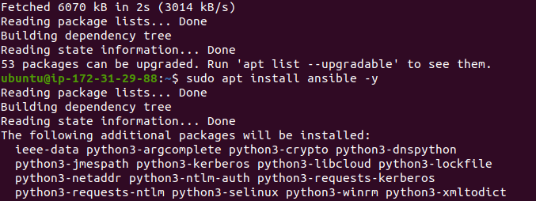
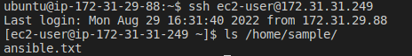

<<<<<<< HEAD
# Ansible Automation of Project7 to Project10
In this project, I configured an Ansible client server as a Bastion Host and and create an Ansible playbook to automate servers configurations for 5 Servers (RedHat and Ubuntu).

## First Step: Install and configure Ansible client to act as a Jump Server/Bastion Host.

1. Update the Name tag of Jenkins EC2 Instance to Jenkins-Ansible which will be used to run the playbooks.

2. Create a new repository and name it ansible-config-mgt in GitHub account.

3. Install Ansible on the Jenkins-Ansible instance.
- Run `sudo apt update`
- Run `sudo apt install ansible -y`

- Check your Ansible version:
- Run `ansible --version`

4. Configure Jenkins build job to save repository content every time there is changed.

- Create a new Freestyle project - ansible, in Jenkins and point it to your ‘ansible-config-mgt’ repository.
Configure Webhook in GitHub and set webhook to trigger ansible build.
 
 

5. Test your setup by making some change in README.MD file in master/main branch and make sure that builds starts automatically and Jenkins saves the files (build artifacts) in archives folder. Forth build triggered automatically in Jenkins.

Run `cat /var/lib/jenkins/jobs/ansible/builds/<build_number>/archive/README.md`

## Second Step – Prepare your development environment using Visual Studio Code
1. Install VScode and configure it to connect to the newly created GitHub repository.

2. Clone down your ansible-config-mgt repo to your Jenkins-Ansible instance.
- Run `git clone nsible-config-mgt repo link`

## Third Step - Begin Ansible Development
1. Create a new branch that will be used for development of a new feature, in your ansible-config-mgt GitHub repository. Add a discriptive name.

2. Checkout the newly created feature branch to your local machine and start building your code and directory structure.

- Create a directory and name it playbooks – it will be used to store all your playbook files.

- Create a directory and name it inventory – it will be used to keep your hosts organised.

3. Within the playbooks folder, create your first playbook, and name it common.yml.

4. Within the inventory folder, create an inventory file (.yml) for each environment (Development, Staging Testing and Production) dev, staging, uat, and prod respectively.

## Forth Step – Set up an Ansible Inventory

1. Launch the 4 EC2 server instances to start configuring the development servers.

- Setup ssh agent on bastian node for easy access to other nodes. For ssh-agent on linux:
- Run `eval `ssh-agent -s`
- `ssh-add <path-to-private-key>`

- connect via ssh into your Jenkins-Ansible server using ssh-agent.

- Run `ssh -A ubuntu@public-ip of Jenkins-Ansible server`

- Confirm the key has been added with the command below and test ssh connection to another server.

- Run `ssh-add -l`

- Update your inventory/dev.yml file with server IP addresses.

## Fifth Step - Create a Common Playbook

1. Update your playbooks/common.yml file with following code:

## Sixth Step – Update GIT with the latest code

1. Push changes made locally to GitHub (especially after review by an extra pair of eyes – it is also called "Four eyes principle".). Commit your code into GitHub. Using `git add ., git commit -m 'message', git push` in the github features branch.

2. Create a Pull Request (PR) as another developer / reviewer of a new feature development and merge the code to the master branch. This triggers an updated build on Jenkins-Ansible server. 

4. checkout from the feature branch into the master, and pull down the latest changes.

## Seventh Step – Run first Ansible test

1. Install wireshark utility (or make sure it is updated to the latest version) on your RHEL 8 and Ubuntu servers using root user, yum for RHEL 8 and apt for Ubuntu.Execute ansible-playbook command and verify if your playbook actually works:

Run `ansible-playbook -i /var/lib/jenkins/jobs/ansible/builds/(latest build number)/archive/inventory/dev.yml /var/lib/jenkins/jobs/ansible/builds/(latest build number)/archive/playbooks/common.yml`

2. check if wireshark has been installed on each of servers.
- Run `which wireshark` or `wireshark --version`

3. Update the ansible playbook with some new Ansible tasks then go through the full checkout -> change codes -> commit -> PR -> merge -> build -> ansible-playbook cycle again.

- Task is to create a directory, file and set timezome on all ther server.

- Task created successfully.

=======

>>>>>>> f5163cd129aac7ff07fcc1fc5374efb77e242a09
