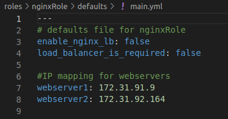
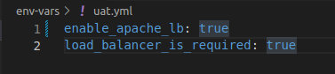

# Ansible Dynamic Assignments (Include) and Community Roles

In this project, I used Ansible configuration management tool to prepare UAT environment for a Tooling web solution. I installed and configured roles for mgsql and load balancers (Apache and Nginx) using ansible galaxy afterwhich I automated the deployment of a tooling web solution.

## First Step: Introducing Dynamic Assignment Into the structure

1. In the ansible-config-mgt GitHub repository start a new branch and call it - dynamic-assignments. Then inside this folder, create a new file and name it env-vars.yml.

3. Create a new folder - env-vars to keep each environment’s variables file. Then Create new YAML files which will used to set the variables.

    
4. Now edit the instruction in the env-vars.yml file like in the snapshot.

## Second Step: Update site.yml with dynamic assignments

1. Update site.yml file to make use of the dynamic assignment and merge branch.

pushed-git.png

2. Create a role for MySQL database – it should install the MySQL package, create a database and configure users. Download Mysql Ansible Role from the community. Here, a MySQL role developed by geerlingguy is used. To preserve the GitHub in actual state after installing the new role – make a commit and push to master directory - ‘ansible-config-mgt’. 
- On Jenkins-Ansible server make sure that git is installed and check the version with git --version, then go to ‘ansible-config-mgt’ directory - 

- Run `git init`
- Run `git pull https://github.com/<(your-name)>/ansible-config-mgt.git`
- Run `git remote add origin https://github.com/<(your-name)>/ansible-config-mgt.git`
- Run `git branch roles-feature`
- Run `git switch roles-feature`

3. Inside roles directory create your new MySQL, nginx and apache roles: 
  - Run `ansible-galaxy install geerlingguy.mysql` and rename the folder to mysql: Run `mv geerlingguy.mysql/ mysql`.
  
  - Run `ansible-galaxy install geerlingguy.nginx` and rename the folder to mysql: Run `mv geerlingguy.nginx/ nginx`.

  - Run `ansible-galaxy install geerlingguy.apache` and rename the folder to mysql: Run `mv geerlingguy.apache/ apache`.

4. Read README.md files in the roles to edit the configuration to use correct credentials for MySQL required for the tooling website.

5. Upload the changes into your GitHub:

- Run `git add`.
- Run `git commit -m "Commit new role files into GitHub"`
- Run `git push --set-upstream origin roles-feature`
- then create a Pull Request and merge it to main branch on GitHub.

## Third Step: Load Balancer roles

1. In nginxRole/defaults/main.yml declare variables - enable_nginx_lb: false same in apacheRole/detaults/main.yml

- Declare another variable in apacheroles/defaults/main.yml. Load_balancer_is_required and set its value to false as well.

2. Update static-assignments/loadbalancers.yml and playbooks/site.yml files respectively.

3. Use the  define which loadbalancer to use in dev and uat environment by setting respective environmental variable to true. To enable nginx, in the env-vars\uat.yml file set `enable_apache_lb` to `true`, `load_balancer_is_required` to `true` and in env-vars\dev.yml file set `enable_nginx_lb` to true and `load_balancer_is_required` to `true`
- The reverse will be the case if apache is to be enabled.

4. Udated inventory for each environment and run Ansible against each environment.

- Run `ansible-playbook -i inventory/uat.yml playbooks/site.yml`

