# Continuous Integration With Jenkins, Ansible, Artifactory, Sonarqube and PHP

## First Step: Setting up Blue ocean and Jenkinsfile.

1. Install Blue Ocean plugin on Jenkins server.

2. Using the blue ocean plugin, created a new pipeline. Choose Github, add Github token and select the corresponding repository.

3. Create deploy/jenkinsfile in ansible-config directory on the Jenkins server.

4. Add a build stage pipeline code snippet into the jenkinsfile to start building it gradually. It uses the shell script module to echo the "Building Stage".

5. Push the update to Gihub account.

6. Configure ansible project on jenkins console to run pipline job from Jenkinsfile automatically.

7. Create a new git branch and name it feature/jenkinspipeline-stages.

8. Add another code snippet pipeline stage called Test in the Jenkinsfile. Push changes to github and then click on "Scan the repository now" in the ansible project in Jenkins to see feature/jenkinspipeline-stages build.

9. Check in Blue Ocean to see how the Jenkinsfile has caused a new step in the pipeline launch build for the new branch.

10. Quick Task
- Create a pull request to merge the latest code into the main branch.

- After merging the PR, go back into your terminal and switch into the main branch. Pull the latest change.

- Create a new branch, add more stages into the Jenkins file to simulate below phases. (Just add an echo command like we have in build and test stages)
   - Package 
   - Deploy 
   - Clean up

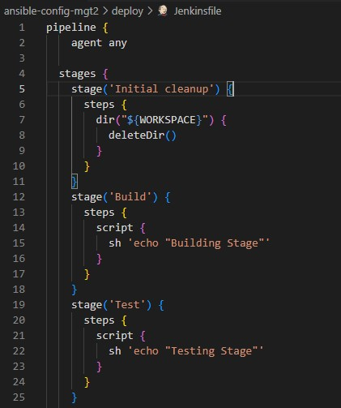

   
- Verify in Blue Ocean that all the stages are working, then merge your feature branch to the main branch

## Second Step - Running  Ansible Playbook From Jenkins

1. Ensure that Ansible and dependencies are installed.
- Run `yum install -y https://dl.fedoraproject.org/pub/epel/epel-release-latest-8.noarch.rpm`
- `yum install -y dnf-utils http://rpms.remirepo.net/enterprise/remi-release-8.rpm`
- `yum install python3 python3-pip wget unzip git -y`
- `python3 -m pip install --upgrade setuptools`
- `python3 -m pip install --upgrade pip`
- `python3 -m pip install PyMySQL`
- `python3 -m pip install mysql-connector-python`
- `python3 -m pip install psycopg2==2.7.5 --ignore-installed`
 

2. Install postgresql community.

3. Install ansible plugin on jenkins console.

 ## Third Step: Run ansible from Jenkins (against the Dev environment successfully).

1. Launch two EC2 server instances (one RedHat for Nginx and Ubuntu for DB) and update dev file.

2. Update the content of deploy/jenkinsfile to export environment variables, export ansible.cfg file, specify neccessary stages in the file, and generate and add private key to Jenkins via UI.

3. Configure ansible on Jenkins via UI and update site.yml file with required changes including generating pipeline script for runing ansible.

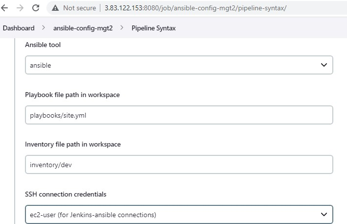

4. Scan Repository and the build process in blue ocean.

5. Update Jenkinsfile to introduce parameterization. Reference inventory as a parameter (So that Jenkins can run ansible against any selected environment in the inventory file).

6. In the Ansible execution section, remove the hardcoded inventory/dev and replace with `inventory/${inventory}`. Now, playbooks can run against the specified inventory environment.

7. Merge features branch to main branch in Github.

## Forth Step: CI/CD Pipeline for TODO Application
1. Fork given [repo](https://github.com/darey-devops/php-todo.git) and clone the repo unto Jenkins-ansible server.

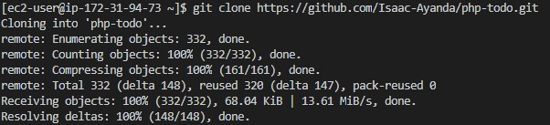

2. Install PHP, its dependencies and composer (Ref..README.md).

3. Install 'plot plugin' on jenkins console.

4. Install 'artifactory plugin' on jenkins console then configure artifactory. Launch another EC2 instance as artifactory server, add its private IP details to ci environment, and configure role that can install artifactory from jenkins server.

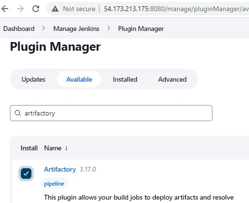

- Update site.yml file with necessary ansible configuration for artifactory and update static assignment directory.

5. Comment out all except artricatory configuration in site.yml, commit to git and then run the playbook in Jenkins by changing the  build with parameter option of the inventory file to ci  to install artifactory.

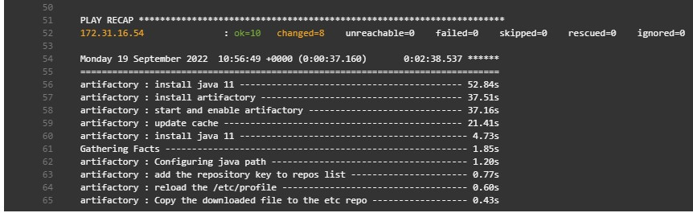

6. Access the artifactory server. private-ip:8081 or 8082 to login, create repository and configure artifactory server by adding instance id, url, username and password. Then apply and save.

## Fifth Step: Integrate Artifactory and Install Sounarcube.

1. Update the mysql roles to create database homestead, user - homestead and grant permissions.to create the database on the db instance. The user must be at the private ip address of the jenkins server.

2. Create another jenkins file in php-todo directory then push to update repo.

3. Ensure mysql client is installed on Jenkins server. Also set bind address on the db server to 0.0.0.0 by editing the mysqld.cnf file - `sudo vi /etc/mysql/mysql.conf.d/mysqld.cnf` and restart mysql server. Update DB connection inside the .env.sample file - DB_HOST= Private IP of the db server, DB_CONNECTION=mysql, DB_PORT=3306. Then test connection to db server from Jenkins server. Afterwards, update repo at github with latest changes.

4. Create a new pipeline in blueocean for the php-todo app and then build now.

5. Update the Jenkinsfile to include Unit tests step. Then push to github and build on Jenkins console.

## Sixth Step: Code Quality Analysis

1. Add the code analysis step in Jenkinsfile. The output of the data will be saved in build/logs/phploc.csv file.

2. Ensure phpunit and phploc are installed on Jenkins server. Then add a plot code coverage report stage to the Jenkinsfile. Push to Github then build now to see the update.

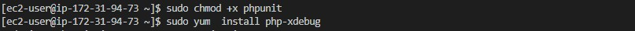

3. Package the artifact and deploy to the artifactory server. First, install zip. Add stages to Jenkinsfile and commit changes to github. Then build now. Upload artifactory successfully.

4. Deploy the application to the dev environment by launching Ansible pipeline. Add Deploy stage to Jenkinsfile and uncomment only todo config in site.yml file. Lauch a Todo Server and add private Ip to the dev environment, update static-assignments/deployment.yml with artifactory path with password then commit changes to Github.

[update static-assignments/deployment.yml](./images/artifaactory-details2.jpg)

5. Execute build now on the todo app in Jenkins console. This begins and later calls ansible-project to run its playbook before ending.

## Seventh Step: Introduce quality gate by using Sonarqube.

1. Introduce quality gate so that app does not deploy to production environment if unit test and code coverage may not be enough. Launch an Ubuntu EC2 intance (t2.medium) as sonarqube server and comeup with a role that can install sonarqube on the server. Add private ip to ci environment and update site.yml file and install community postgresql is installed for ansible to work properly. Commit to Github.

2. In the ansible project at Jenkins console and run the inventory build parameter with the ci environment to install sonarqube successfully.

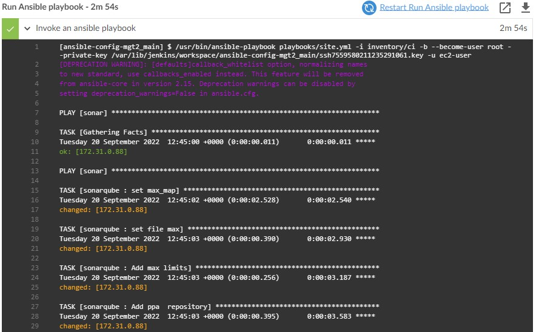

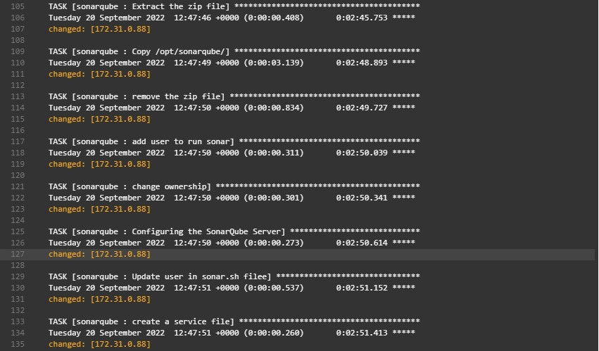

## Eight Step: Acess and Integrate Sonarqube into the Jenkins Pipeline.

1. Access sonarqube via url:9000 with login details admin.

2. Install the sonar scanner plugin In Jenkins.

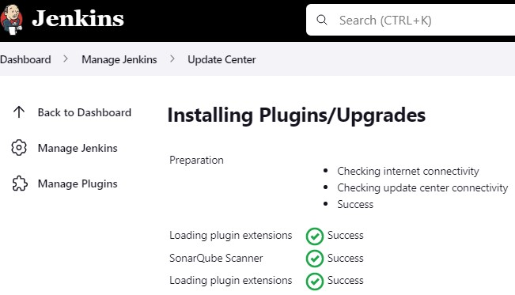

3. Configure the plugin in Jenkins console. Navigate to configure system in Jenkins. Add SonarQube server url and generate authentication token from Sonarqube console (Admin>my account>security).

4. Configure Quality Gate Jenkins Webhook in SonarQube – The URL should point to the Jenkins server http://{JENKINS_HOST}/sonarqube-webhook/ (Administration > Configuration > Webhooks > Create). Then Setup SonarQube scanner from Jenkins – Global Tool Configuration.

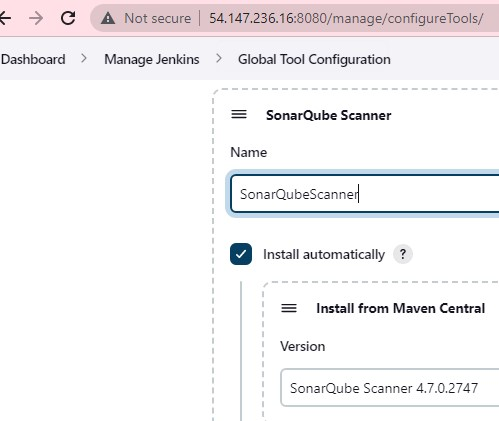

5. Update Jenkins Pipeline in Todo directory to include SonarQube scanning and Quality Gate, commit changes then scan Todo repo. 

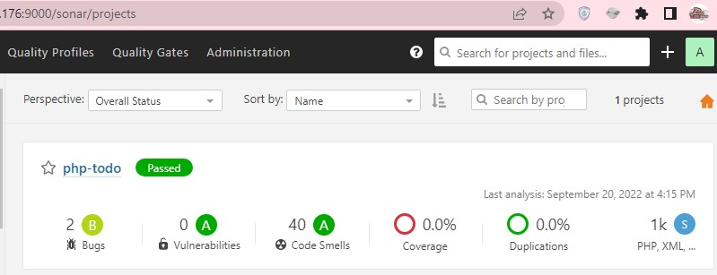

- Update the SonarQube Quality Gate stage in the Php/Jenkinsfile to ensure that the quality gate does not deploy applications to the production environment if there are bugs or issues with the code then commit to update changes. Ensure npm is installed and xdebug.mode=develop,debug,coverage on the jenkins server. Build aborted since the code did not pass quality check.

6. The sonarqube quality gate failed then the need to Configure sonar-scanner.properties by accessing the tools directory on the sunarqube server to configure the properties file in which SonarQube will require to function during pipeline execution. Then "Restart SonarQube Quality Gate" for it to run successfully

- Run `cd /var/lib/jenkins/tools/hudson.plugins.sonar.SonarRunnerInstallation/SonarQubeScanner/conf/`
- Open sonar-scanner.properties file. Run `sudo vi sonar-scanner.properties` then add configuration related to php-todo project.

## Ninth Step: Introducing Jenkins Agent.

- Configured webhook between jenkins server and github to automatically run a build job when there is a push by setting up webhook at Github with Jenkins server public ip details. Launch a new server -agent1 as Jenkins-slave and install Java on it. Then configure it on Jenkins as agent.

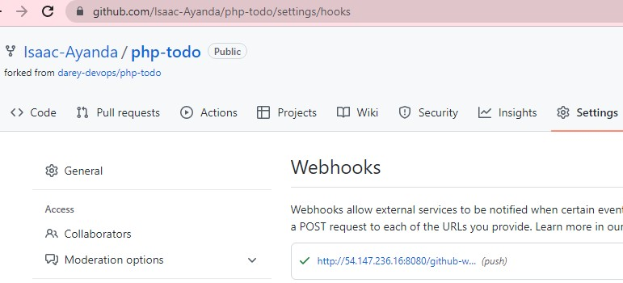

