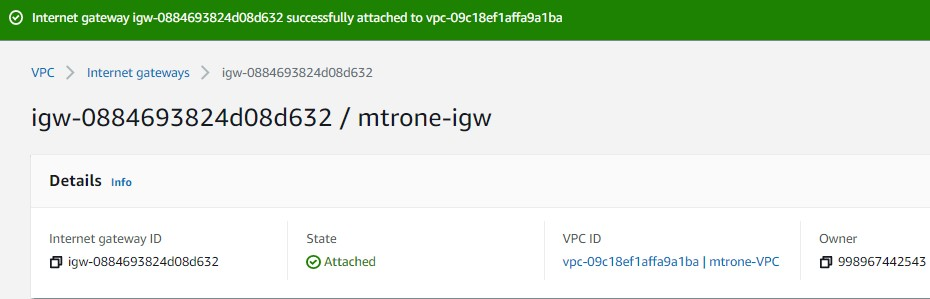
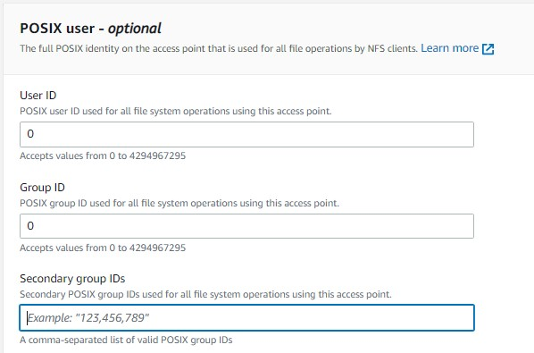
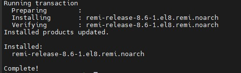
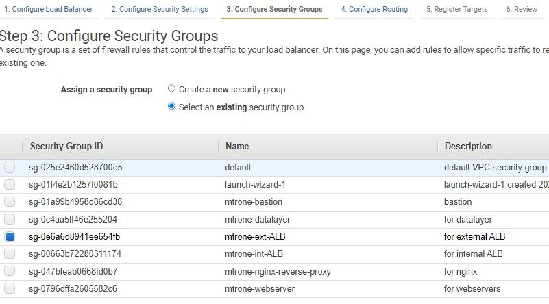
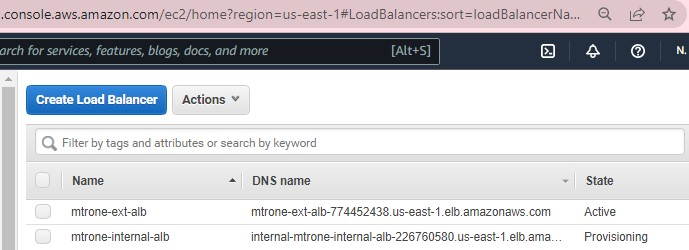
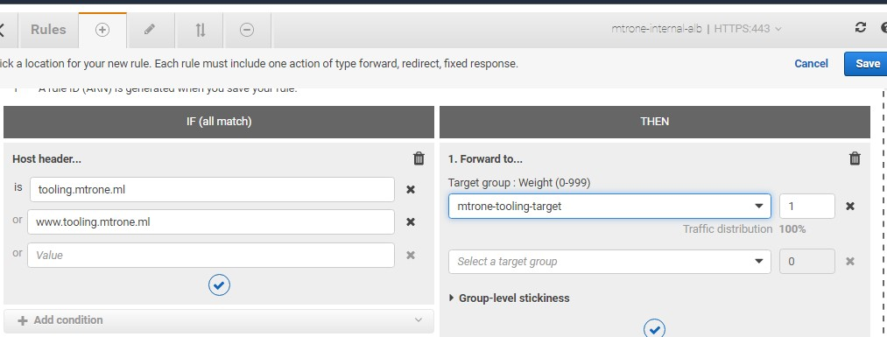
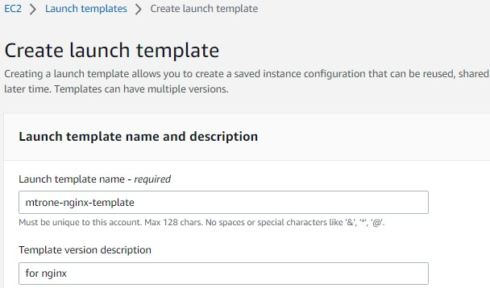
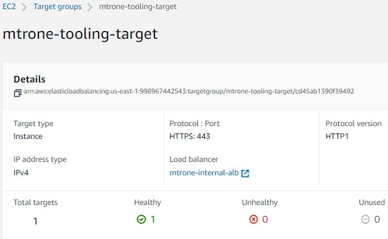

# AWS Cloud Solution For Two Company Websites Using A Reserve Proxy Technology
In this project, I built a secure three-teir infrastructure solutin inside AWS VPC (Virtual Private Cloud) network for a fictitious company that uses WordPress CMS for its corperate website, and a [Tooling](https://github.com/Isaac-Ayanda/tooling) Website for their DevOps team - As part of the company’s desire for improved security and performance, a decision has been made to realize the infrastructure setup using NGINX reverse proxy technology. The infrastructure would need to be resilient and at optimized cost.

## Project Architecture Diagram
#

## First Step: Setup a Virtual Private Network (VPC)

1. Create a [VPC](https://console.aws.amazon.com/vpc/home) on Amazon Web Services portal.

2. Edit and enable DNS hostnames.

3. Create Internet G
gateway and attach it to the VPC.

4. Create public subnet and availability zone using an allocation scheme.

5. Create private subnet and availability zone using an allocation scheme.

6. Create two route tables - Public and private.

7. Associate the public subnet to the public route table and associate the private subnet to the private route table via corresponding association tab.

8. Create an elastic IP that is going to be attached to the NAT gateway. 

9. Edit the route of the public subnet  to use the internet gateway and edit the route of the private subnet to use the NAT gateway.

10. Create security groups for application loadbancer.

11. Create security group for bastion server.

12. Create security group for nginx reverse proxy server. Inbound rule should only allow traffic from the application loadbalancer (i.e. refering the security group of the application loadbalancer) and ensure that bastion server have ssh access to the reverse proxy server.

13. Create security group for the internal loadbalancer. Inbound rule allows traffic (http/https) only from nginx reverse proxy.

14. Create security group for the webserver such that its inbound rule should only allow SSH traffic from the Bastion and https/http traffic from the internal loadbalancer.

15. Create security group for the data layer such that Mysql/Aurora access specified for bastion and webserver, and NFS access specified for webserver.

16. First register a domain name. This can be obtained from freenom and transfer its settings to AWS to ensure cost savings. Then go to AWS certificate manager to create the certificate to be attached to the application loadbalancer.

17. Create Amazon Elastic file system. Add mount target (i.e. specify it in private subnets 1 and 2 and select the datalayer security group). Then create each access points for the tooling and wordpress sites on the AE file system. The webservers will have seperate mounts. This will avoid file overide.

18. Create a KMS Key to be used to encrypt the database instance, and a subnet group before creating the RDS. The kms key can be selected under production and dev/test setting to  encrypt the database but not available under the free teir.

Second Step: Setup Compute Resources
1. Before creating an autoscalling group there is need to first create a target group, launch template (Consist of AMIs and user data) and Loandbalancers. The autoscalling group will make use of launch templates and loadbalancers to spinup instances. Create AMIs by launching 3 t-2micro RedHat instances for nginx, bastion and webserver then install AMI dependencies starting with the bastion server.

- Connect and install ami dependencies on bastion server. 
    - Run `yum install -y https://dl.fedoraproject.org/pub/epel/epel-release-latest-8.noarch.rpm`
    - `yum install -y dnf-utils http://rpms.remirepo.net/enterprise/remi-release-8.rpm`
    - `yum install wget vim python3 telnet htop git mysql net-tools chrony -y`
    - `systemctl start chronyd`
    - `systemctl enable chronyd`

2. Connect and install ami dependencies on nginx reverseproxy server.
    - Run `yum install -y https://dl.fedoraproject.org/pub/epel/epel-release-latest-8.noarch.rpm`
    - `yum install -y dnf-utils http://rpms.remirepo.net/enterprise/remi-release-8.rpm`
    - `yum install wget vim python3 telnet htop git mysql net-tools chrony -y`
    - `systemctl start chronyd`
    - `systemctl enable chronyd`

- Configure selinux policies for nginx server.
    -   Run `setsebool -P httpd_can_network_connect=1`
    -   `setsebool -P httpd_can_network_connect_db=1`
    -   `setsebool -P httpd_execmem=1`
    -   `setsebool -P httpd_use_nfs 1`

- Install the amazon efs utils for mounting the target on elastic file system.
    -   Run `git clone https://github.com/aws/efs-utils`
    -   `cd efs-utils`
    -   `yum install -y make`
    -   `yum install -y rpm-build`
    -   `make rpm`
    -   `yum install -y ./build/amazon-efs-utils*rpm`
    

- Install self-signed certificate (use the private ip dns of the nginx instance as the server host name).
    -   Run `sudo mkdir /etc/ssl/private`
    -   `sudo chmod 700 /etc/ssl/private`
    -   `openssl req -x509 -nodes -days 365 -newkey rsa:2048 -keyout /etc/ssl/private/ACS.key -out /etc/ssl/certs/ACS.crt`
    -   `sudo openssl dhparam -out /etc/ssl/certs/dhparam.pem 2048`
       

- Confirm setup by runing an ls -l command on path `/etc/ssl/certs/`

3. Connect and install ami dependencies on webserver.
 - Run `yum install -y https://dl.fedoraproject.org/pub/epel/epel-release-latest-8.noarch.rpm`
    - `yum install -y dnf-utils http://rpms.remirepo.net/enterprise/remi-release-8.rpm`
    - `yum install wget vim python3 telnet htop git mysql net-tools chrony -y`
    - `systemctl start chronyd`
    - `systemctl enable chronyd`

- Configure selinux policies for webserver.
    -   Run `setsebool -P httpd_can_network_connect=1`
    -   `setsebool -P httpd_can_network_connect_db=1`
    -   `setsebool -P httpd_execmem=1`
    -   `setsebool -P httpd_use_nfs 1`

- Install the amazon efs utils for mounting the target on elastic file system.
    -   Run `git clone https://github.com/aws/efs-utils`
    -   `cd efs-utils`
    -   `yum install -y make`
    -   `yum install -y rpm-build`
    -   `make rpm`
    -   `yum install -y ./build/amazon-efs-utils*rpm`
    

- Install self-signed certificate using apache setup (use the private ip dns of the webserver instance as the server hostname). Also edit the ssl.conf file and specify the path to the ssl certificate and KEY. ie. SSLCertificateFile /etc/pki/tls/certs/ACS.crt and SSLCertificateKeyFile /etc/pki/tls/private/ACS.key)
    -   Run `yum install -y mod_ssl`
    -   `openssl req -newkey rsa:2048 -nodes -keyout /etc/pki/tls/private/ACS.key -x509 -days 365 -out /etc/pki/tls/certs/ACS.crt`
    - `vi /etc/httpd/conf.d/ssl.conf`
       

4. Create AMI from each of the instances.

5. Create target group for instances to be placed behind the loadbalancer -(then create target group. the autoscalling group will launch instance into the nginx target group) nginx, wordpress and tooling.

Step Three: Configure Application Load Balancer (ALB)
1. Create loadbalancers in order to specify the target groups.

- Create internal loadbalancer with https protocol, two availability zones in private subnet, select internal lb security group, configure routing and select wordpress target as the existing target.

- Set rules on the internal loadbalancer. Click listeners tab then click on view & edit rules. Insert rule:select Host header: tooling.mtrone.lm.

2. Create Launch templates.
- Create launch template for bastion server. Network interface placed in public subnet, select bastion security group, auto assign IP: enabled then go to advance details section and add the bastion user data. 

- Create launch template for nginx. Placed in public subnet and add the user data. 

- Create launch template for wordpress in a private subnet. Webserver security group. Disable public ip. Also update the mount point to the filesystem by copying the command without the efs and also update the rds end point in the 'wordpress user data.md file. Remember to login to the rds to create the database. Also ensure all other credentials are correct.

- Create launch template for tooling using the same AMI used for wordpress. It is created in a private subnet with webserver security group. Disable public ip. Then add the user-data under advanced but ensure the credentials are correct. Update the RDS endpoint for tooling in the user data file . Also update the mount point to the assess point filesystem by copying the command without the efs. Remember to login to the RDS to create the database.

3. Create Autoscaling group.
- Create autoscaling group for bastion to adhere to bastion launch template with public subnet1 & public subnet2, No attached loadbalancer, ELB health checked, Target tracking scaling policy to 90 and add notifications.

- Create autoscaling group for nginx with adhere to nginx launch template in public subnet1 & public subnet2, attach to existing mtrone-nginx-target HTTPS loadbalancer, ELB health checked, target tracking scaling policy value of 90 and add notifications.

- Login to RDS via bastion to create dbs for wordpress and tooling.  

- Create autoscaling group for wordpress. (ensure target group are healthy before proceeding) Create autoscaling group for wordpress with adhere to wordpress launch template in private subnet1 & private subnet2, attach to existing mtrone-wordpress-target HTTPS loadbalancer, ELB health checked, target tracking scaling policy value of 90 and add notifications. 

- Create autoscaling group for tooling. Create autoscaling group for tooling with adhere to tooling launch template in private subnet1 & private subnet2, attach to existing mtrone-tooling-target HTTPS loadbalancer, ELB health checked, target tracking scaling policy value of 90 and add notifications. 

- Add further records to mtrone.ml domain at route 53 for the loadbalancer.
- Current status:

- Create record for tooling. i.e for every request the domain receives it should be forwarded to the loadbalancer.

- The tooling and wordpress websites accessible via web browser follows:

