# Automating The Creation of Infrastructure With IAC (Terraform)
## Setup Workspace

- Create S3 bucket to store Terraform state file.

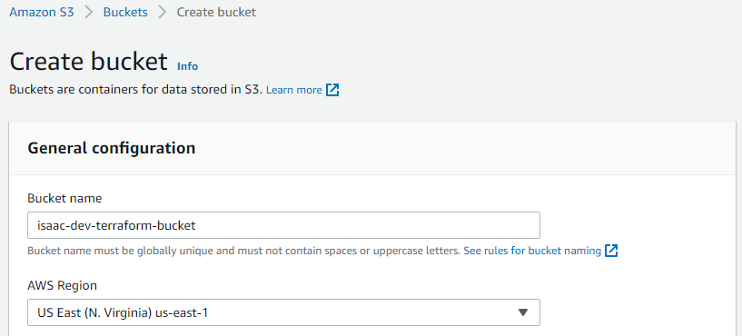
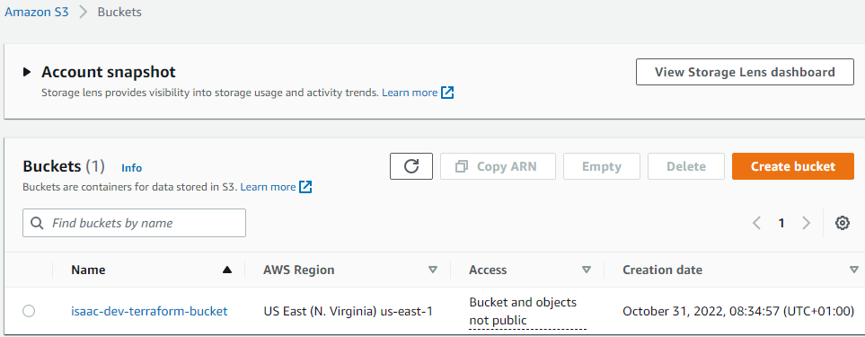


- Install and configure AWS CLI access

- Install Python SDK (boto3)

- Configure secrete key and access key then access the bucket using AWS CLI
- Access the bucket using boto3

## Create VPC and Subnets

- Create a directory and a file named main.tf in the PBL directory

- Write the Provider and resources section

```HCL
provider "aws" {
	region = "us-east-1"
}

resource "aws_vpc" "main" {
	cidr_block						= "172.16.0.0/16"
	enable_dns_support				= "true"
	enable_dns_hostname				= "true"
	enable_classiclink				= "false"
	enable_classiclink_dns_support	= "false"

	tags = merge(
    var.tags,
    {
      Name = format("%s-VPC", var.name)
    },
  )
}
```


- Run ```terraform init``` to download necessary plugins for terraform to work

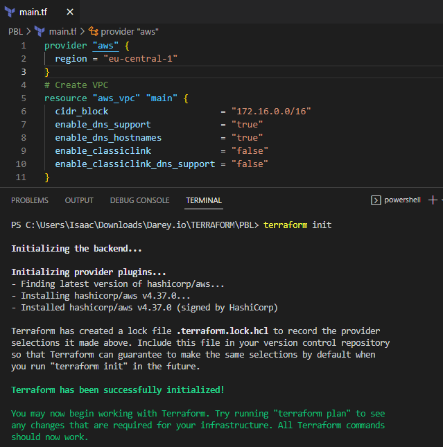

- Run ```terraform plan```

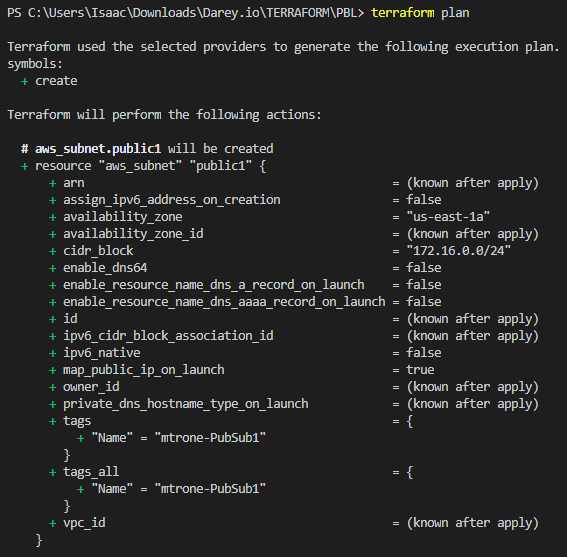
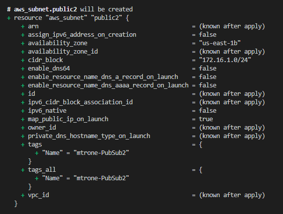
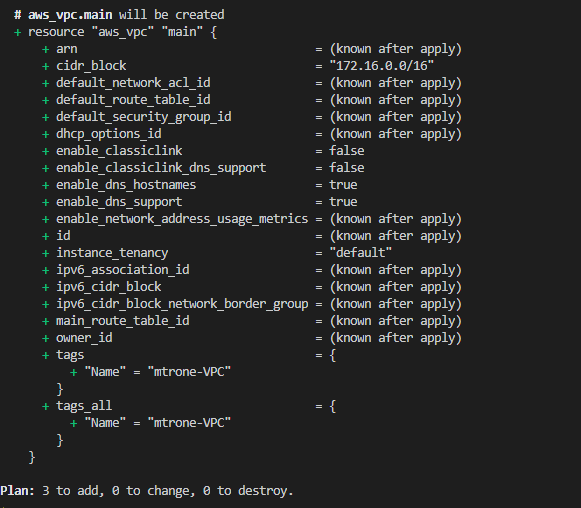


## Code Refactoring
- Fixing Hard Coded Values
```HCL
# Create VPC
resource "aws_vpc" "main" {
  cidr_block                     = var.vpc_cidr
  enable_dns_support             = var.enable_dns_support
  enable_dns_hostnames           = var.enable_dns_hostnames
  enable_classiclink             = var.enable_classiclink
  enable_classiclink_dns_support = var.enable_classiclink_dns_support

}

```
- Fixing multiple resource blocks by fetching data using Terraform data sources

```HCL
# Create public subnets
resource "aws_subnet" "public" {
  count  = var.preferred_number_of_public_subnets == null ? length(data.aws_availability_zones.available.names) : var.preferred_number_of_public_subnets   
  vpc_id = aws_vpc.main.id
  cidr_block              = cidrsubnet(var.vpc_cidr, 4 , count.index)
  map_public_ip_on_launch = true
  availability_zone       = data.aws_availability_zones.available.names[count.index]

    }

```

- Run ```terraform plan```

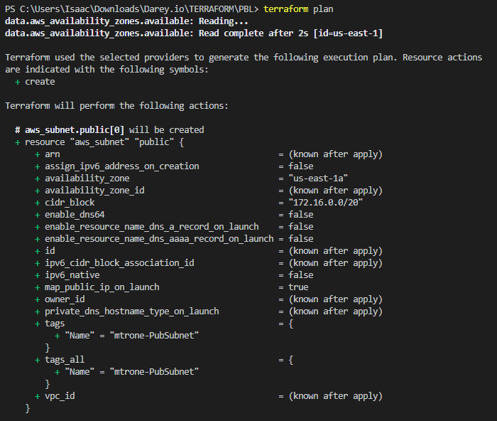
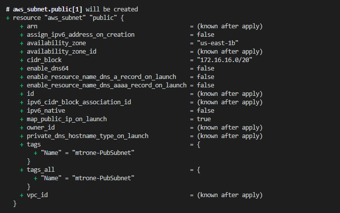
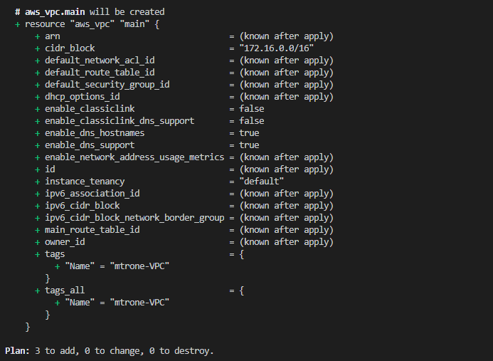

- Run ```terraform apply```

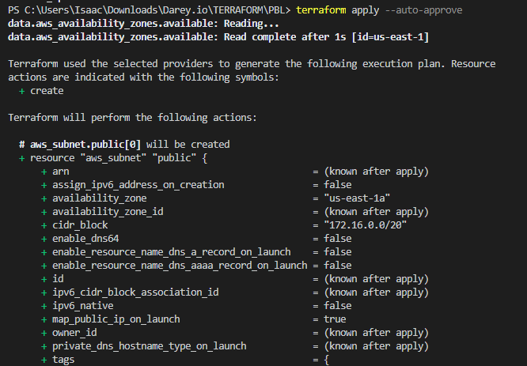
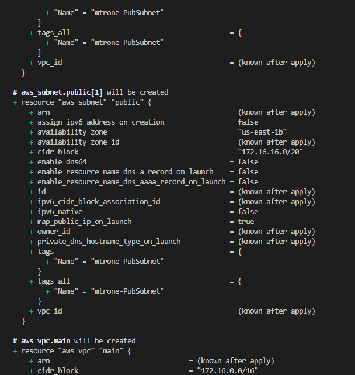
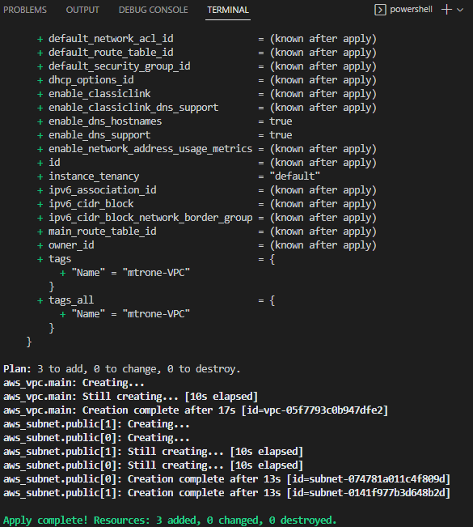
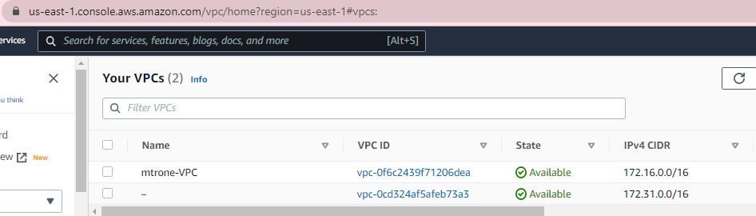
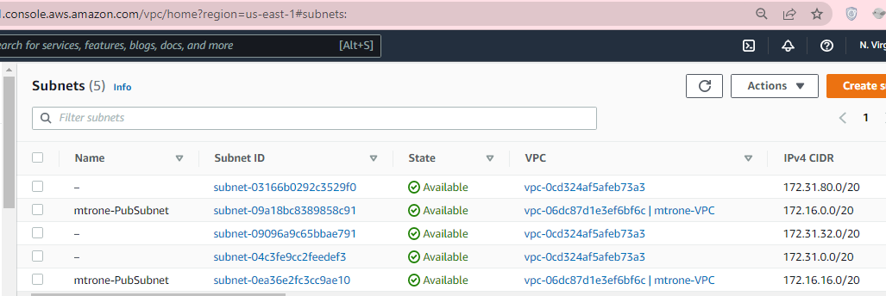

- Run ```terraform destroy```

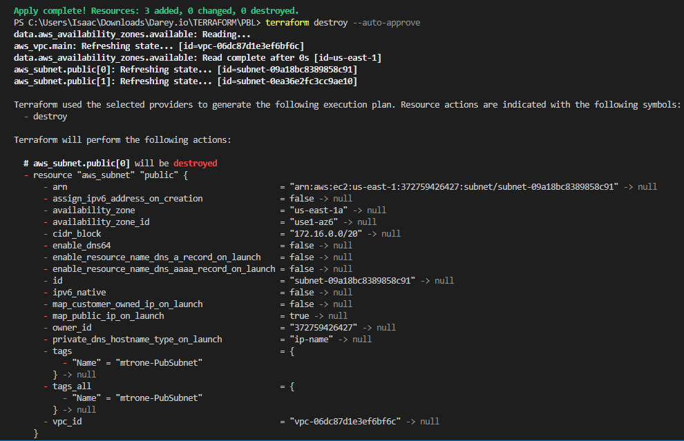
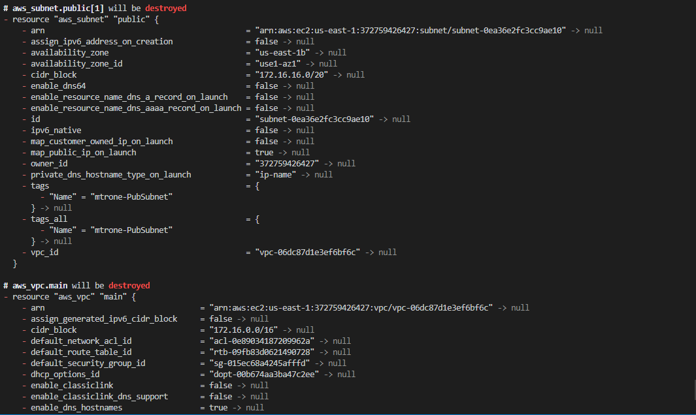
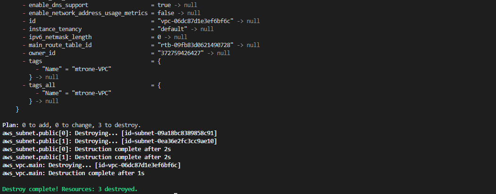

