# More Automating Infrastructure With IAC (Terraform)

## Setup Networking of the Architecture

- Add tags to ```terraform.tfvars``` file

```t
tags = {
  Environment = "dev"
  Owner-Email = "izik******@***.com"
  Managed-by  = "Terraform"
}
```
- In main.tf, create 2 public subnets

```t
resource "aws_subnet" "public" {

count                   = var.preferred_number_of_public_subnets == null ? length(data.aws_availability_zones.available.names) : var.preferred_number_of_public_subnets
  vpc_id                  = aws_vpc.main.id
  cidr_block              = cidrsubnet(var.vpc_cidr, 8, count.index)
  map_public_ip_on_launch = true
  availability_zone       = data.aws_availability_zones.available.names[count.index]

  tags = merge(
    var.tags,
    {
      Name = format("%s-PublicSubnet-%s", var.name, count.index)
    },
  )
}
```

- Create 4 private subnets

```t
resource "aws_subnet" "private" {

  count                   = var.preferred_number_of_private_subnets == null ? length(data.aws_availability_zones.available.names) : var.preferred_number_of_private_subnets
  vpc_id                  = aws_vpc.main.id
  cidr_block              = cidrsubnet(var.vpc_cidr, 8, count.index + 2)
  map_public_ip_on_launch = true
  availability_zone       = data.aws_availability_zones.available.names[count.index]

  tags = merge(
    var.tags,
    {
      Name = format("%s-PrivateSubnet-%s", var.name, count.index)
    },
  )
}
```

- Create ```internet_gw.tf``` file
- Create Internet Gateway

```t
resource "aws_internet_gateway" "ig" {
  vpc_id = aws_vpc.main.id

  tags = merge(
    var.tags,
    {
      Name = format("%s-%s-%s", var.name, aws_vpc.main.id, IG)
    }
  )
}
```

- Create a new file ```nat-gw.tf``` file
- Create one NAT Gateway

```t
resource "aws_nat_gateway" "nat" {
  allocation_id = aws_eip.nat_eip.id
  subnet_id     = element(aws_subnet.public_subnet.*.id, 0)
  #   Depends on Internet gateway
  depends_on = [aws_internet_gateway.ig]

  tags = merge(
    var.tags,
    {
      Name = format("%s-NAT-%s", var.name, var.environment)
    }
  )
}
```

- In the same file add one EIP address depends on Internet Gateway


```t
resource "aws_eip" "nat_eip" {
  vpc = true
  #   Depends on Internet gateway
  depends_on = [aws_internet_gateway.ig]

  tags = merge(
    var.tags,
    {
      Name = format("%s-EIP-%s", var.name, var.environment)
    }
  )
}
```

- Create  ```route_tables.tf``` file
- Create private route table

```t
resource "aws_route_table" "private_rtb" {
  vpc_id = aws_vpc.main.id

  tags = merge(
    var.tags,
    {
      Name = format("%s-private-rtb", var.name, var.environment)
    }
  )
}
```

- Associate all private subnets to the private route table

```t
resource "aws_route_table_association" "private_subnet_association" {
  count          = length(aws_subnet.private_subnet[*].id)
  subnet_id      = element(aws_subnet.private_subnet[*].id, count.index)
  route_table_id = aws_route_table.private_rtb.id
}
```

- Create public route table

```t
resource "aws_route_table" "public_rtb" {
  vpc_id = aws_vpc.main.id

  tags = merge(
    var.tags,
    {
      Name = format("%s-public-rtb", var.name)
    }
  )
}
```

- Create route for public route table and attach the Internet Gateway

```t
resource "aws_route" "public_rtb_route" {
  route_table_id         = aws_route_table.public_rtb.id
  destination_cidr_block = "0.0.0.0/0"
  gateway_id             = aws_internet_gateway.igw.id
}
```

- Associate all public subnets to the public route table

```t
resource "aws_route_table_association" "public_subnet_association" {
  count          = length(aws_subnet.public_subnet[*].id)
  subnet_id      = element(aws_subnet.public_subnet[*].id, count.index)
  route_table_id = aws_route_table.public_rtb.id
}
```


## Setup Identity and Access Management

- Create ```roles.tf``` file
- Create ```AssumeRole```

```t
resource "aws_iam_role" "ec2_instance_role" {
  name = "ec2_instance_role"
  assume_role_policy = jsonencode({
    Version = "2012-10-17"
    Statement = [
      {
        Action = "sts:AssumeRole"
        Effect = "Allow"
        Sid    = ""
        Principal = {
          Service = "ec2.amazonaws.com"
        }
      },
    ]
  })

  tags = merge(
    var.tags,
    {
      Name = "aws assume role"
    }
  )
}
```

- Create ```IAM Policy``` for this role

```t
resource "aws_iam_policy" "policy" {
  name        = "ec2_instance_policy"
  description = "A test policy"
  policy = jsonencode({
    Version = "2012-10-17"
    Statement = [
      {
        Action   = ["ec2:Describe*"]
        Effect   = "Allow"
        Resource = "*"
      },
    ]
  })

  tags = merge(
    var.tags,
    {
      Name = "aws assume policy"
    }
  )
}
```

- Attach the ```Policy``` to the ```IAM Role```

```t
resource "aws_iam_role_policy_attachment" "test_attach" {
  role       = aws_iam_role.ec2_instance_role.name
  policy_arn = aws_iam_policy.policy.arn
}
```

- Create an ```Instance Profile``` and interpolate the ```IAM Role```

```t
resource "aws_iam_instance_profile" "ip" {
  name = "aws_instance_profile_test"
  role = aws_iam_role.ec2_instance_role.name
}
```


### Create Security Groups

- Create ```security.tf``` file
- Create ```ext-alb-sg``` to allow HTTP and HTTPS traffic

```t
resource "aws_security_group" "ext_alb_sg" {
  name        = "ext_alb_sg"
  description = "allow HTTP and HTTPS traffic from anywhere"
  vpc_id      = aws_vpc.main.id

  # Inbound Traffic
  ingress {
    description = "HTTP"
    from_port   = 80
    to_port     = 80
    protocol    = "tcp"
    cidr_blocks = ["0.0.0.0/0"]
  }

  ingress {
    description = "HTTPS"
    from_port   = 443
    to_port     = 443
    protocol    = "tcp"
    cidr_blocks = ["0.0.0.0/0"]
  }

  # Outbound Traffic
  egress {
    from_port   = 0
    to_port     = 0
    protocol    = "tcp"
    cidr_blocks = ["0.0.0.0/0"]
  }

  tags = merge(
    var.tags,
    {
      Name = "ext-alb-sg"
    }
  )
}

# Add rule to allow ssh access from bastion_sg
resource "aws_security_group_rule" "inbound_ext_alb_ssh" {
  type                     = "ingress"
  from_port                = 22
  to_port                  = 22
  protocol                 = "tcp"
  source_security_group_id = aws_security_group.bastion_sg.id
  security_group_id        = aws_security_group.ext_alb_sg.id
}
```

- Create ```bastion-sg``` for SSH access


```t
resource "aws_security_group" "bastion_sg" {
  name        = "bastion_sg"
  description = "Allow SSH access from anywhere"
  vpc_id      = aws_vpc.main.id

  # Inbound Traffic
  ingress {
    description = "SSH"
    from_port   = 22
    to_port     = 22
    protocol    = "tcp"
    cidr_blocks = ["0.0.0.0/0"]
  }

  # Outbound Traffic
  egress {
    from_port   = 0
    to_port     = 0
    protocol    = "tcp"
    cidr_blocks = ["0.0.0.0/0"]
  }

  tags = merge(
    var.tags,
    {
      Name = "Bastion-sg"
    }
  )
}
```

- Create ```nginx-sg``` to allow HTTP and HTTPS traffic from the external load balancer and SSH access from bastion instance

```t
resource "aws_security_group" "nginx_sg" {
  name   = "nginx_sg"
  vpc_id = aws_vpc.main.id

  # Outbound Traffic
  egress {
    from_port   = 0
    to_port     = 0
    protocol    = "tcp"
    cidr_blocks = ["0.0.0.0/0"]
  }

  tags = merge(
    var.tags,
    {
      Name = "Nginx-sg"
    }
  )
}

# Add rule to allow http traffic from ext_alb_sg
resource "aws_security_group_rule" "inbound_nginx_http" {
  type                     = "ingress"
  from_port                = 80
  to_port                  = 80
  protocol                 = "tcp"
  source_security_group_id = aws_security_group.ext_alb_sg.id
  security_group_id        = aws_security_group.nginx_sg.id
}

# Add rule to allow https traffic from ext_alb_sg
resource "aws_security_group_rule" "inbound_nginx_https" {
  type                     = "ingress"
  from_port                = 443
  to_port                  = 443
  protocol                 = "tcp"
  source_security_group_id = aws_security_group.ext_alb_sg.id
  security_group_id        = aws_security_group.nginx_sg.id
}

# Add rule to allow ssh access from bastion_sg
resource "aws_security_group_rule" "inbound_nginx_ssh" {
  type                     = "ingress"
  from_port                = 22
  to_port                  = 22
  protocol                 = "tcp"
  source_security_group_id = aws_security_group.bastion_sg.id
  security_group_id        = aws_security_group.nginx_sg.id
}
```

- Create ```int-alb-sg``` to allow HTTP and HTTPS traffic from the nginx reverse proxy server


```t
resource "aws_security_group" "int_alb_sg" {
  name   = "int_alb_sg"
  vpc_id = aws_vpc.main.id

  # Outbound Traffic
  egress {
    from_port   = 0
    to_port     = 0
    protocol    = "tcp"
    cidr_blocks = ["0.0.0.0/0"]
  }

  tags = merge(
    var.tags,
    {
      Name = "Int-ALB-sg"
    }
  )
}

# Add rule to allow http traffic from nginx_sg
resource "aws_security_group_rule" "inbound_int_alb_http" {
  type                     = "ingress"
  from_port                = 80
  to_port                  = 80
  protocol                 = "tcp"
  source_security_group_id = aws_security_group.nginx_sg.id
  security_group_id        = aws_security_group.int_alb_sg.id
}

# Add rule to allow https traffic from nginx_sg
resource "aws_security_group_rule" "inbound_int_alb_https" {
  type                     = "ingress"
  from_port                = 443
  to_port                  = 443
  protocol                 = "tcp"
  source_security_group_id = aws_security_group.nginx_sg.id
  security_group_id        = aws_security_group.int_alb_sg.id
}
```

- Create ```webserver-sg``` to allow traffic from the internal load balancer and bastion


```t
resource "aws_security_group" "webserver_sg" {
  name   = "webserver_sg"
  vpc_id = aws_vpc.main.id

  # Outbound Traffic
  egress {
    from_port   = 0
    to_port     = 0
    protocol    = "tcp"
    cidr_blocks = ["0.0.0.0/0"]
  }

  tags = merge(
    var.tags,
    {
      Name = "WebServer-sg"
    }
  )
}

# Add rule to allow http traffic from int_alb_sg
resource "aws_security_group_rule" "inbound_web_http" {
  type                     = "ingress"
  from_port                = 80
  to_port                  = 80
  protocol                 = "tcp"
  source_security_group_id = aws_security_group.int_alb_sg.id
  security_group_id        = aws_security_group.webserver_sg.id
}

# Add rule to allow https traffic from int_alb_sg
resource "aws_security_group_rule" "inbound_web_https" {
  type                     = "ingress"
  from_port                = 443
  to_port                  = 443
  protocol                 = "tcp"
  source_security_group_id = aws_security_group.int_alb_sg.id
  security_group_id        = aws_security_group.webserver_sg.id
}

# Add rule to allow ssh access from bastion_sg
resource "aws_security_group_rule" "inbound_webserver_ssh" {
  type                     = "ingress"
  from_port                = 22
  to_port                  = 22
  protocol                 = "tcp"
  source_security_group_id = aws_security_group.bastion_sg.id
  security_group_id        = aws_security_group.webserver_sg.id
}
```

- Create ```datalayer-sg``` to allow traffic from webserver on nfs and mysql port and bastion host on mysql

```t
resource "aws_security_group" "datalayer_sg" {
  name   = "datalayer_sg"
  vpc_id = aws_vpc.main.id

  # Outbound Traffic
  egress {
    from_port   = 0
    to_port     = 0
    protocol    = "tcp"
    cidr_blocks = ["0.0.0.0/0"]
  }

  tags = merge(
    var.tags,
    {
      Name = "Datalayer-sg"
    }
  )
}

# Add rule to allow NFS traffic from webserver_sg
resource "aws_security_group_rule" "inbound_nfs_port" {
  type                     = "ingress"
  from_port                = 2049
  to_port                  = 2049
  protocol                 = "tcp"
  source_security_group_id = aws_security_group.webserver_sg.id
  security_group_id        = aws_security_group.datalayer_sg.id
}

# Add rule to allow MySQL traffic from webserver_sg
resource "aws_security_group_rule" "inbound_webserver_mysql" {
  type                     = "ingress"
  from_port                = 3306
  to_port                  = 3306
  protocol                 = "tcp"
  source_security_group_id = aws_security_group.webserver_sg.id
  security_group_id        = aws_security_group.datalayer_sg.id
}

# Add rule to allow MySQL access from bastion_sg
resource "aws_security_group_rule" "inbound_datalayer_mysql" {
  type                     = "ingress"
  from_port                = 3306
  to_port                  = 3306
  protocol                 = "tcp"
  source_security_group_id = aws_security_group.bastion_sg.id
  security_group_id        = aws_security_group.datalayer_sg.id
}
```

### Create certificate from ACM

- Create ```cert.tf``` file
- Create certificate using a wildcard

```t
resource "aws_acm_certificate" "mtrone" {
  domain_name       = "*.mtrone.ml"
  validation_method = "DNS"
}
# Ensure to have added the domain mtrone.ml from freenom to route 53
# Call the hosted zone
data "aws_route53_zone" "mtrone" {
  name         = "mtrone.ml"
  private_zone = false
}
```

- Validate the certificate

```t
# DNS validation - Writing the DNS validation record to Route53
resource "aws_route53_record" "mtrone" {
  for_each = {
    for dvo in aws_acm_certificate.mtrone.domain_validation_options : dvo.domain_name => {
      name   = dvo.resource_record_name
      record = dvo.resource_record_value
      type   = dvo.resource_record_type
    }
  }

  allow_overwrite = true
  name            = each.value.name
  records         = [each.value.record]
  ttl             = 60
  type            = each.value.type
  zone_id         = data.aws_route53_zone.yheancarh_zone.zone_id
}

# Validate the certificate using DNS
resource "aws_acm_certificate_validation" "yheancarh_cert_val" {
  certificate_arn         = aws_acm_certificate.mtrone.arn
  validation_record_fqdns = [for record in aws_route53_record.mtrone : record.fqdn]
}
```

- Create records for tooling

```t
resource "aws_route53_record" "tooling" {
  zone_id = data.aws_route53_zone.mtrone.zone_id
  name    = "tooling.mtrone.ml"
  type    = "A"

  alias {
    name                   = aws_lb.ext_alb.dns_name
    zone_id                = aws_lb.ext_alb.zone_id
    evaluate_target_health = true
  }
}
```

- Create records for wordpress

```t
resource "aws_route53_record" "wordpress" {
  zone_id = data.aws_route53_zone.mtrone.zone_id
  name    = "wordpress.mtrone.ml"
  type    = "A"

  alias {
    name                   = aws_lb.ext_alb.dns_name
    zone_id                = aws_lb.ext_alb.zone_id
    evaluate_target_health = true
  }
}
```


### Create an External Application Load Balancer

- Create ```alb.tf``` file
- Create ```ext-alb``` to balance traffic between the nginx instances

```t
resource "aws_lb" "ext_alb" {
  name               = "ext-alb"
  internal           = false
  load_balancer_type = "application"
  security_groups    = [aws_security_group.ext_alb_sg.id]
  subnets            = [for subnet in aws_subnet.public_subnet : subnet.id]
  ip_address_type    = "ipv4"

  tags = merge(
    var.tags,
    {
      Name = format("%s-ext-alb", var.name)
    }
  )
}
```

- Create target group for nginx

```t
resource "aws_lb_target_group" "nginx_tgt" {
  name        = "nginx-tgt"
  port        = 443
  protocol    = "HTTPS"
  vpc_id      = aws_vpc.main.id
  target_type = "instance"

  health_check {
    interval            = 10
    path                = "/healthstatus"
    protocol            = "HTTPS"
    timeout             = 5
    healthy_threshold   = 5
    unhealthy_threshold = 2
  }
}
```

- Create listener for nginx target group to listen on ```ext-alb```

```t
resource "aws_lb_listener" "nginx_listener" {
  load_balancer_arn = aws_lb.ext_alb.arn
  port              = 443
  protocol          = "HTTPS"
  ssl_policy        = "ELBSecurityPolicy-2016-08"
  certificate_arn   = aws_acm_certificate_validation.mtrone.certificate_arn

  default_action {
    type             = "forward"
    target_group_arn = aws_lb_target_group.nginx_tgt.arn
  }
}
```

- Create ```outputs.tf``` file to print the alb name and nginx target group arn

```t
output "alb_dns_name" {
  value = aws_lb.ext-alb.dns_name
}

output "alb_target_group_arn" {
  value = aws_lb_target_group.nginx-tgt.arn
}

```


### Create Internal Application Load Balancer

- Create ```int-alb```

```t
resource "aws_lb" "ialb" {
  name               = "int-alb"
  internal           = true
  load_balancer_type = "application"
  security_groups    = [aws_security_group.int_alb_sg.id]
  subnets            = [aws_subnet.private_subnet[0].id, aws_subnet.private_subnet[1].id]
  ip_address_type    = "ipv4"

  tags = merge(
    var.tags,
    {
      Name = format("%s-int-alb", var.name)
    }
  )
}
```

- Create target group for wordpress and tooling

```t
# Wordpress Target Group
resource "aws_lb_target_group" "wordpress_tgt" {
  name        = "wordpress-tgt"
  port        = 443
  protocol    = "HTTPS"
  vpc_id      = aws_vpc.main.id
  target_type = "instance"

  health_check {
    interval            = 10
    path                = "/healthstatus"
    protocol            = "HTTPS"
    timeout             = 5
    healthy_threshold   = 5
    unhealthy_threshold = 2
  }
}

# Tooling Target Group
resource "aws_lb_target_group" "tooling_tgt" {
  name        = "tooling-tgt"
  port        = 443
  protocol    = "HTTPS"
  vpc_id      = aws_vpc.main.id
  target_type = "instance"

  health_check {
    interval            = 10
    path                = "/healthstatus"
    protocol            = "HTTPS"
    timeout             = 5
    healthy_threshold   = 5
    unhealthy_threshold = 2
  }
}
```

- Create listener for wordpress and tooling target groups

```t
# Wordpress Listener
resource "aws_lb_listener" "web_listener" {
  load_balancer_arn = aws_lb.int_alb.arn
  port              = 443
  protocol          = "HTTPS"
  ssl_policy        = "ELBSecurityPolicy-2016-08"
  certificate_arn   = aws_acm_certificate_validation.mtrone.certificate_arn

  default_action {
    type             = "forward"
    target_group_arn = aws_lb_target_group.wordpress_tgt.arn
  }
}

# Tooling Listener rule
resource "aws_lb_listener_rule" "tooling_listener" {
  listener_arn = aws_lb_listener.web_listener.arn
  priority     = 99

  action {
    type             = "forward"
    target_group_arn = aws_lb_target_group.tooling_tgt.arn
  }

  condition {
    host_header {
      values = ["tooling.mtrone.ml"]
    }
  }
}
```


### Create an Auto Scaling Groups

- Create ```asg-bastion-nginx.tf``` file
- Create SNS topic for the autoscaling groups

```t
resource "aws_sns_topic" "mtrone_sns" {
  name = "Default_CloudWatch_Alarms_Topic"
}
```

- Create notification for all the autoscaling groups

```t
resource "aws_autoscaling_notification" "mtrone_notifications" {
  group_names = [
    aws_autoscaling_group.bastion_asg.name,
    aws_autoscaling_group.nginx_asg.name,
    aws_autoscaling_group.wordpress_asg.name,
    aws_autoscaling_group.tooling_asg.name
  ]

  notifications = [
    "autoscaling:EC2_INSTANCE_LAUNCH",
    "autoscaling:EC2_INSTANCE_TERMINATE",
    "autoscaling:EC2_INSTANCE_LAUNCH_ERROR",
    "autoscaling:EC2_INSTANCE_TERMINATE_ERROR",
  ]

  topic_arn = aws_sns_topic.mtrone_sns.arn
}
```

- Create launch template and autoscaling for bastion

```t
# Get list of AZs
resource "random_shuffle" "az_list" {
  input = data.aws_availability_zones.available.names
}

# Create Launch Template for Bastion
resource "aws_launch_template" "bastion_launch_template" {
  image_id               = var.ami
  instance_type          = "t2.micro"
  vpc_security_group_ids = [aws_security_group.bastion_sg.id]

  iam_instance_profile {
    name = aws_iam_instance_profile.ip.id
  }

  key_name = var.keypair

  placement {
    availability_zone = "random_shuffle.az_list.result"
  }

  lifecycle {
    create_before_destroy = true
  }

  tag_specifications {
    resource_type = "instance"

    tags = merge(
      var.tags,
      {
        Name = "Bastion_launch_template"
      }
    )
  }
}

# Auto Scaling for Bastion
resource "aws_autoscaling_group" "bastion_asg" {
  name                      = "bastion_asg"
  max_size                  = 2
  min_size                  = 2
  health_check_grace_period = 300
  health_check_type         = "ELB"
  desired_capacity          = 2

  vpc_zone_identifier = [for subnet in aws_subnet.public_subnet : subnet.id]

  launch_template {
    id      = aws_launch_template.bastion_launch_template.id
    version = "$Latest"
  }

  tag {
    key                 = "Name"
    value               = "mtrone-bastion"
    propagate_at_launch = true
  }
}
```

- Create launch template and autoscaling for nginx and attach them it to the external load balancer

```t
# Launch Template for Nginx
resource "aws_launch_template" "nginx_launch_template" {
  image_id               = var.ami
  instance_type          = "t2.micro"
  vpc_security_group_ids = [aws_security_group.webserver_sg.id]

  iam_instance_profile {
    name = aws_iam_instance_profile.ip.id
  }

  key_name = var.keypair

  placement {
    availability_zone = "random_shuffle.az_list.result"
  }

  lifecycle {
    create_before_destroy = true
  }

  tag_specifications {
    resource_type = "instance"

    tags = merge(
      var.tags,
      {
        Name = "Nginx_launch_template"
      }
    )
  }

  user_data = filebase64("${path.module}/nginx.sh")
}

# Auto Scaling for Nginx
resource "aws_autoscaling_group" "nginx_asg" {
  name                      = "nginx_asg"
  max_size                  = 2
  min_size                  = 1
  health_check_grace_period = 300
  health_check_type         = "ELB"
  desired_capacity          = 1

  vpc_zone_identifier = [aws_subnet.private_subnet[0].id, aws_subnet.private_subnet[1].id]

  launch_template {
    id      = aws_launch_template.nginx_launch_template.id
    version = "$Latest"
  }

  tag {
    key                 = "Name"
    value               = "mtrone-nginx"
    propagate_at_launch = true
  }
}

# Attaching Auto Scaling Group of nginx to external ALB
resource "aws_autoscaling_attachment" "asg_attachment_nginx" {
  autoscaling_group_name = aws_autoscaling_group.nginx_asg.id
  lb_target_group_arn    = aws_lb_target_group.nginx_tgt.arn
}
```

- Create ```asg-websever.tf``` file
- Create launch template, autoscaling for wordpress and attach them to the internal load balancer

```t
# Launch Template for Wordpress
resource "aws_launch_template" "wordpress_launch_template" {
  image_id               = var.ami
  instance_type          = "t2.micro"
  vpc_security_group_ids = [aws_security_group.webserver_sg.id]

  iam_instance_profile {
    name = aws_iam_instance_profile.ip.id
  }

  key_name = var.keypair

  placement {
    availability_zone = "random_shuffle.az_list.result"
  }

  lifecycle {
    create_before_destroy = true
  }

  tag_specifications {
    resource_type = "instance"

    tags = merge(
      var.tags,
      {
        Name = "Wordpress_launch_template"
      }
    )
  }

  user_data = filebase64("${path.module}/wordpress.sh")
}

# Auto Scaling for Wordpress
resource "aws_autoscaling_group" "wordpress-asg" {
  name                      = "wordpress-asg"
  max_size                  = 2
  min_size                  = 1
  health_check_grace_period = 300
  health_check_type         = "ELB"
  desired_capacity          = 1

  vpc_zone_identifier = [aws_subnet.private_subnet[0].id, aws_subnet.private_subnet[1].id]

  launch_template {
    id      = aws_launch_template.wordpress_launch_template.id
    version = "$Latest"
  }

  tag {
    key                 = "Name"
    value               = "mtrone-wordpress"
    propagate_at_launch = true
  }
}

# Attaching Auto Scaling Group of wordpress to internal ALB
resource "aws_autoscaling_attachment" "asg_attachment_wordpress" {
  autoscaling_group_name = aws_autoscaling_group.wordpress_asg.id
  lb_target_group_arn    = aws_lb_target_group.wordpress_tgt.arn
}
```

- Create launch template, autoscaling for tooling and attach them to the internal load balancer

```t
# Launch Template for Tooling
resource "aws_launch_template" "tooling_launch_template" {
  image_id               = var.ami
  instance_type          = "t2.micro"
  vpc_security_group_ids = [aws_security_group.webserver_sg.id]

  iam_instance_profile {
    name = aws_iam_instance_profile.ip.id
  }

  key_name = var.keypair

  placement {
    availability_zone = "random_shuffle.az_list.result"
  }

  lifecycle {
    create_before_destroy = true
  }

  tag_specifications {
    resource_type = "instance"

    tags = merge(
      var.tags,
      {
        Name = "Tooling_launch_template"
      }
    )
  }

  user_data = filebase64("${path.module}/tooling.sh")
}

# Auto Scaling for Tooling
resource "aws_autoscaling_group" "tooling_asg" {
  name                      = "tooling_asg"
  max_size                  = 2
  min_size                  = 1
  health_check_grace_period = 300
  health_check_type         = "ELB"
  desired_capacity          = 1

  vpc_zone_identifier = [aws_subnet.private_subnet[0].id, aws_subnet.private_subnet[1].id]

  launch_template {
    id      = aws_launch_template.tooling_launch_template.id
    version = "$Latest"
  }

  tag {
    key                 = "Name"
    value               = "mtrone-tooling"
    propagate_at_launch = true
  }
}

# Attaching Auto Scaling Group of tooling to internal ALB
resource "aws_autoscaling_attachment" "asg_attachment_tooling" {
  autoscaling_group_name = aws_autoscaling_group.tooling_asg.id
  lb_target_group_arn    = aws_lb_target_group.tooling_tgt.arn
}
```


### Create Elastic File System

- Create ```efs.tf``` file
- Create a key from AWS Key Management System

```t
resource "aws_kms_key" "mtrone_kms" {
  description = "KMS key "
  policy      = <<EOF
	{
		"Version": "2012-10-17",
		"Id" : "kms-key-policy",
		"Statement" : [
			{
				"Sid": "Enable IAM User Permissions",
				"Effect": "Allow",
				"Principal": { "AWS": "arn:aws:iam::${var.account_no}:user/izik" },
				"Action": "kms:*",
				"Resource": "*"
			}
		]
	}
	EOF
}
```

- Create key alias

```t
resource "aws_kms_alias" "alias" {
  name          = "alias/kms"
  target_key_id = aws_kms_key.mtrone-kms.key_id
}
```

- Create Elastic File System

```t
resource "aws_efs_file_system" "mtrone_efs" {
  encrypted  = true
  kms_key_id = aws_kms_key.mtrone-kms.arn

  tags = merge(
    var.tags,
    {
      Name = "mtrone-efs"
    }
  )
}
```

- Create the mount targets

```t
resource "aws_efs_mount_target" "subnet_1" {
  file_system_id  = aws_efs_file_system.yheancarh_efs.id
  subnet_id       = aws_subnet.private[0].id
  security_groups = [aws_security_group.datalayer-sg.id]
}

resource "aws_efs_mount_target" "subnet_2" {
  file_system_id  = aws_efs_file_system.yheancarh_efs.id
  subnet_id       = aws_subnet.private[1].id
  security_groups = [aws_security_group.datalayer-sg.id]
}
```

- Create the Access Points

```t
# Create access point for wordpress
resource "aws_efs_access_point" "wordpress" {
  file_system_id = aws_efs_file_system.mtrone-efs.id

  posix_user {
    gid = 0
    uid = 0
  }

  root_directory {
    path = "/wordpress"

    creation_info {
      owner_gid   = 0
      owner_uid   = 0
      permissions = 0755
    }
  }
}

# Create access point for tooling
resource "aws_efs_access_point" "tooling_ap" {
  file_system_id = aws_efs_file_system.mtrone-efs.id

  posix_user {
    gid = 0
    uid = 0
  }

  root_directory {
    path = "/tooling"

    creation_info {
      owner_gid   = 0
      owner_uid   = 0
      permissions = 0755
    }
  }
}
```


### Create Relational Database

 - Create ```rds.tf``` file
 - Create subnet group for the RDS instance

```t
resource "aws_db_subnet_group" "mtrone_rds" {
  name       = "mtrone-rds"
  subnet_ids = [aws_subnet.private_subnet[2].id, aws_subnet.private_subnet[3].id]

  tags = merge(
    var.tags,
    {
      Name = "mtrone-rds"
    }
  )
}
```

 - Create RDS instance with the subnets group

```t
resource "aws_db_instance" "mtrone-rds" {
  allocated_storage      = 20
  engine                 = "mysql"
  storage_type           = "gp2"
  engine_version         = "5.7"
  instance_class         = "db.t2.micro"
  db_name                = "isaacdb"
  username               = var.master-username
  password               = var.master-password
  parameter_group_name   = "default.mysql5.7"
  db_subnet_group_name   = aws_db_subnet_group.mtrone-rds.name
  skip_final_snapshot    = true
  vpc_security_group_ids = [aws_security_group.datalayer-sg.id]
  multi_az               = "true"
}
```

- Run ```terraform apply```

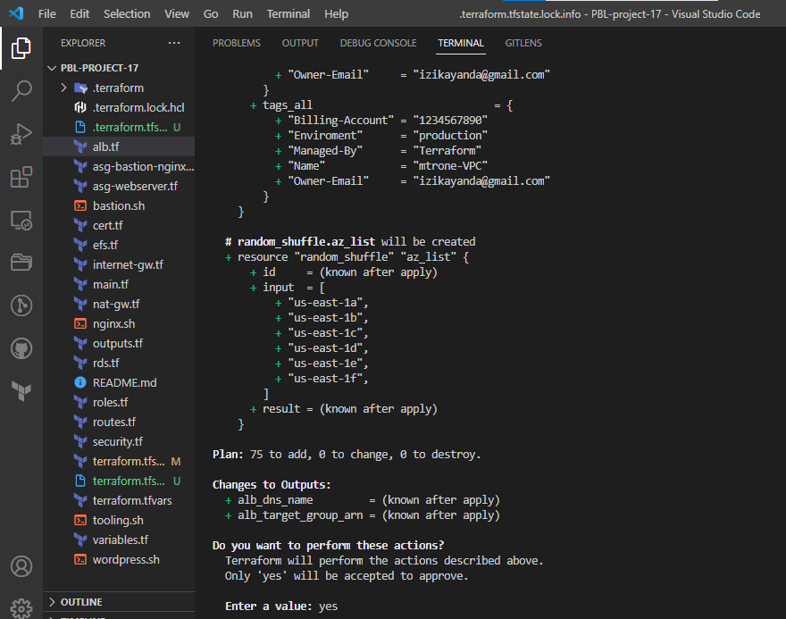

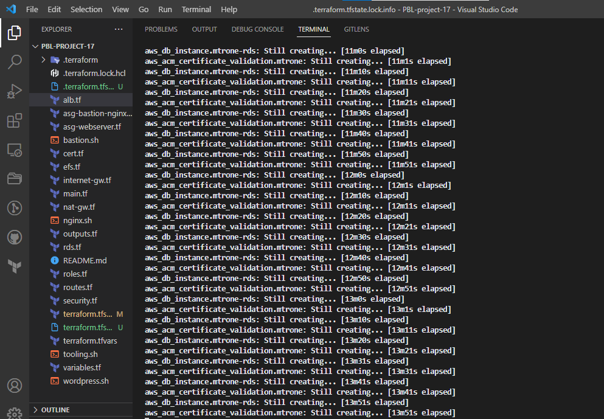

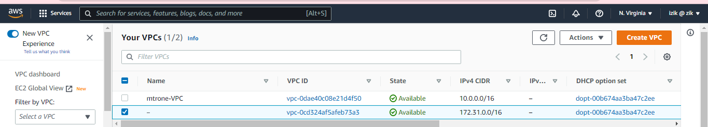

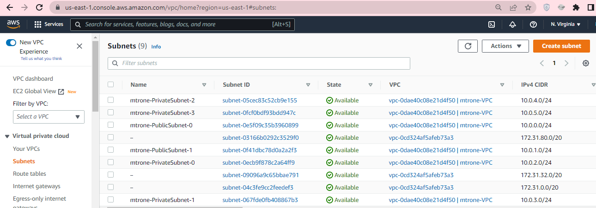

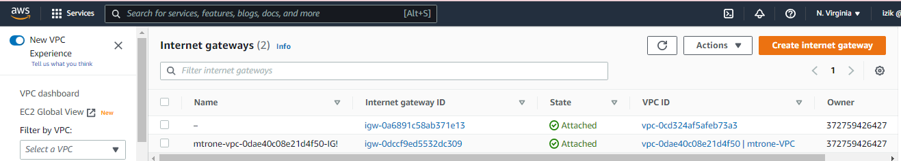


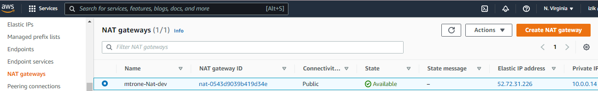

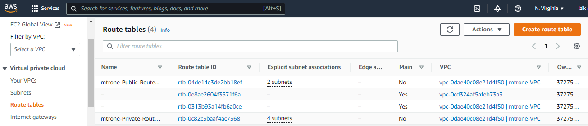

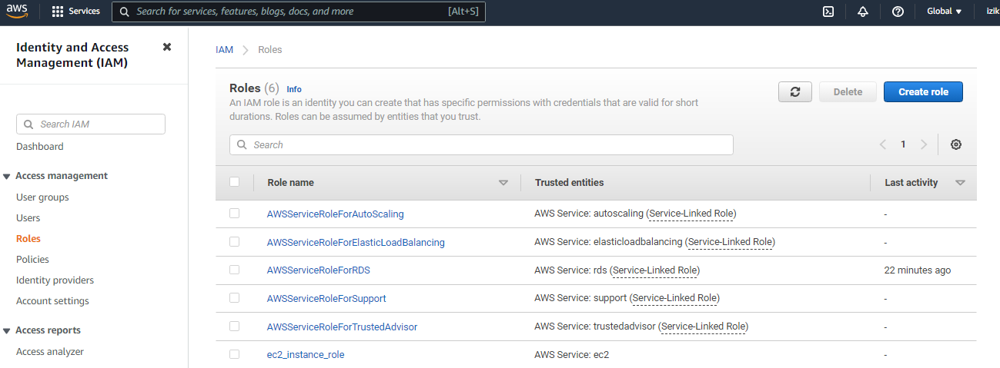

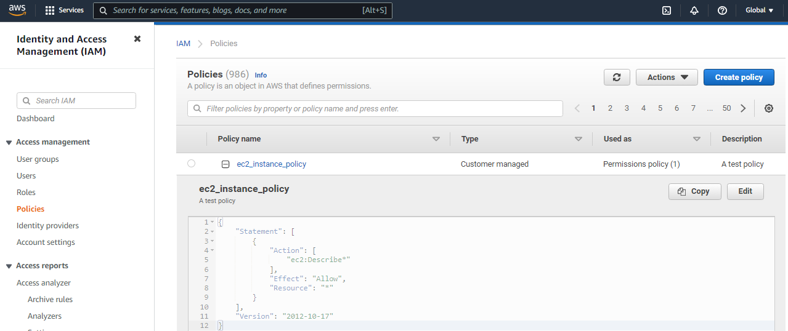

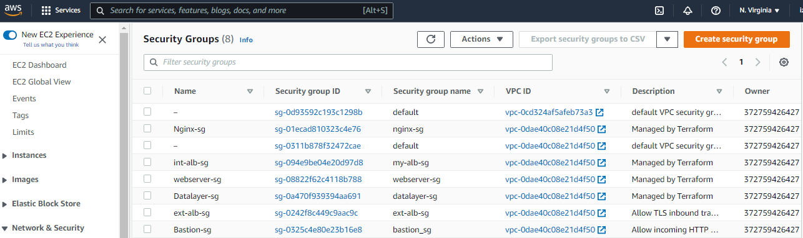

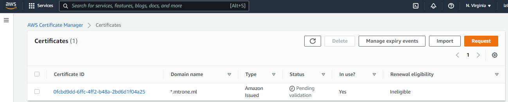

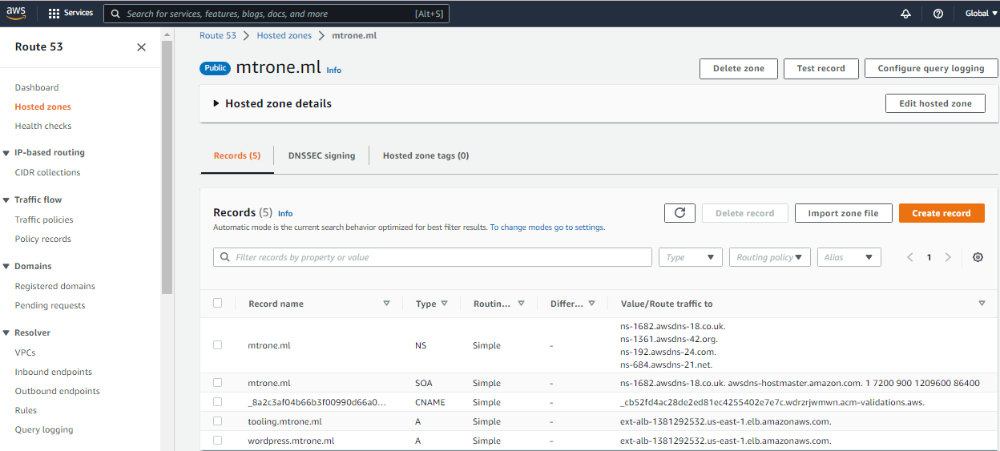

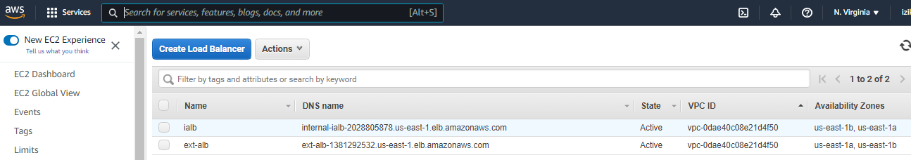

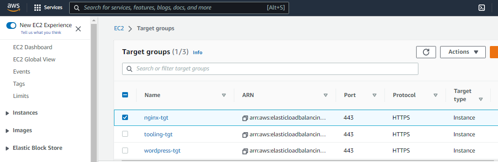

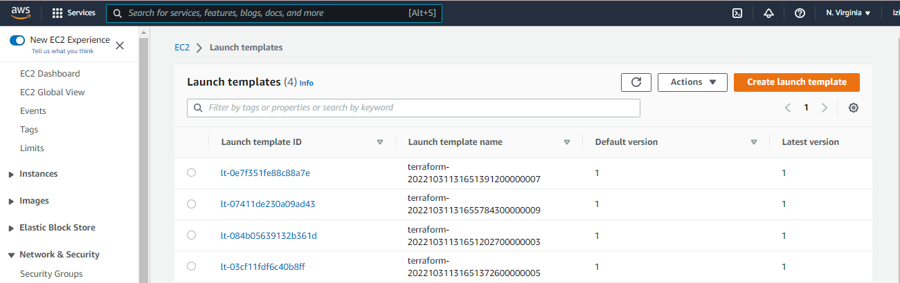

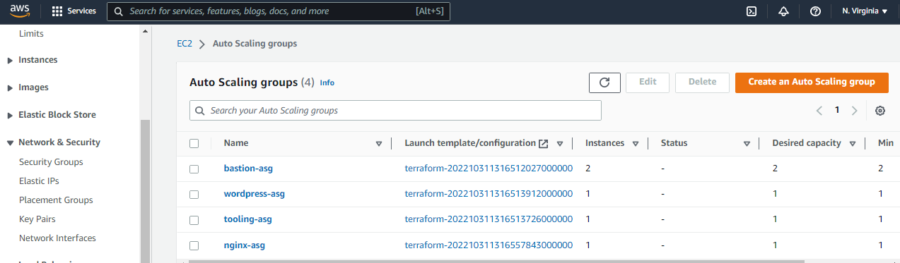

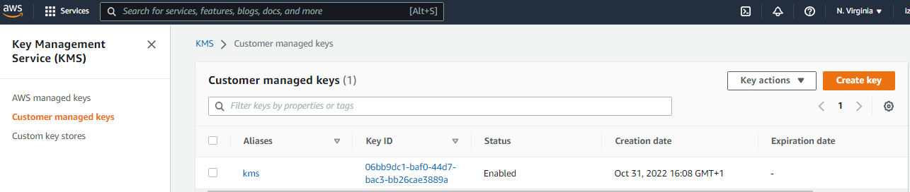

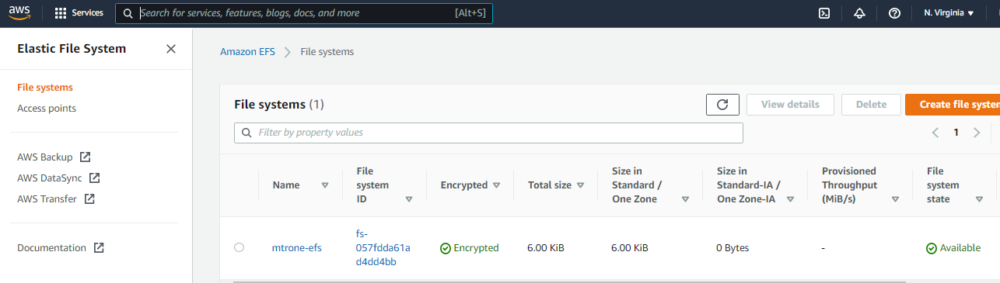
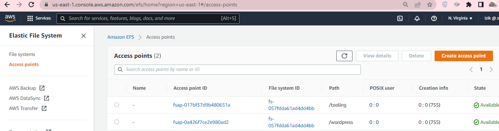

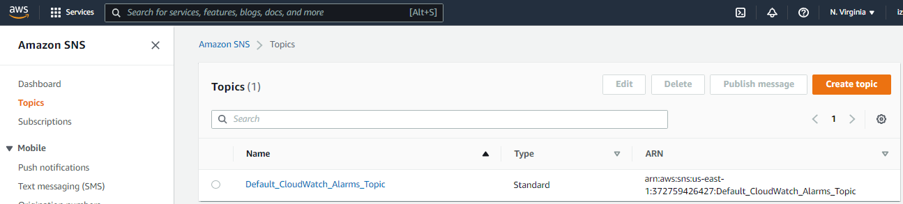

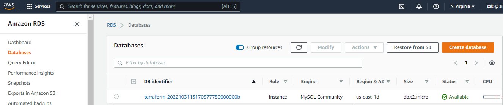

