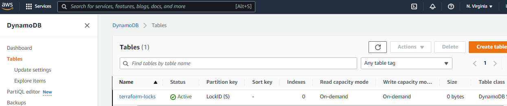

# Further Automation of Infrastructure Implementation With IAC using Terraform
Here, the terraform codes are refactored and packaged into modules.

### Introducing Backend On S3

- Create a file and name it ```backend.tf```

```tf
resource "aws_s3_bucket" "terraform_state" {
  bucket = "isaac-dev-terraform-bucket"
}

resource "aws_s3_bucket_versioning" "version" {
  bucket = aws_s3_bucket.terraform_state.id

  versioning_configuration {
    status = "Enabled"
  }
}

resource "aws_s3_bucket_server_side_encryption_configuration" "terraform_state" {
  bucket = aws_s3_bucket.terraform_state.bucket
  rule {
    apply_server_side_encryption_by_default {
      sse_algorithm = "AES256"
    }
  }
}
```

- Create a DynamoDB table for the lock file and consistency checks

```tf
resource "aws_dynamodb_table" "terraform_locks" {
  name         = "terraform-locks"
  billing_mode = "PAY_PER_REQUEST"
  hash_key     = "LockID"
  attribute {
    name = "LockID"
    type = "S"
  }
}
```

- Configure the S3 backend

```tf
terraform {
  backend "s3" {
    bucket         = "isaac-dev-terraform-bucket"
    key            = "global/s3/terraform.tfstate"
    region         = "us-east-1"
    dynamodb_table = "terraform-locks"
    encrypt        = true
  }
}
```

- Verify the changes run terraform init to migrate local backend to s3 backend





### Rafactoring Project Using Modules

- Setup the modules directory


- Run ```terraform init``` to initialize the modules

- Run ```terraform fmt``` to format the files


- Run ```terraform plan``` 


- Run ```terraform apply``` and ```terraform destroy``` to test the configurations


