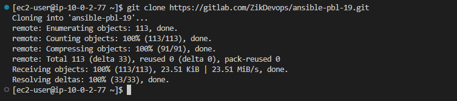
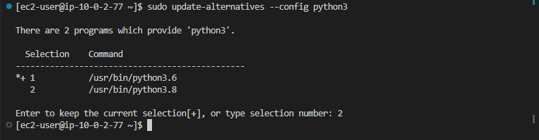
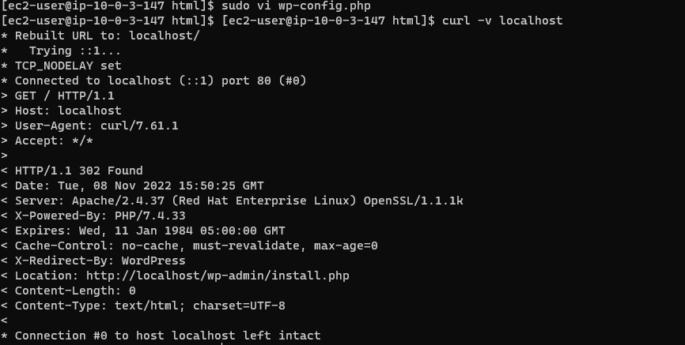

# Automate Infrastructure With IaC using IAC – Terraform Cloud


## Migrate codes to Terraform Cloud

- Create a Terraform Cloud Account
- Create an organization
- Configure a Workspace 


- Configure Environment variables such as secrete key and access key.


- Build AMIs using packer (using an available ami ID teir 2 micro intance from AWS) since AMI owners ID number is not readily available.

```bash
packer build .\web.pkr.hcl
packer build .\bastion.pkr.hcl
packer build .\nginx.pkr.hcl  
packer build .\ubuntu.pkr.hcl   
```


- AMIs created and available on the console.


- Copy AMI id's from packer build and update details in terraform.auto.tfvars file and update terraform cloud settings in backend.tf on the local files then push to update repo on Gitlab. 


### Build Infrastructure With Terraform
- First, comment out listiner, target groups and autoscalling attachment resources (for nginx/web/tooling,  ALB/alb.tf, autoscalling group attachments in  Autoscalling/asg-bastion-nginx.tf, and Autoscaling/asg-webserver.tf). This is to avoid target groups from failing health checks since intances have not been configure.  Then update repo by pushing to gitlab.

    - Run ```terraform plan``` and ```terraform apply``` from Terraform cloud console to automatically deploy the infrastructure. Then confirm and apply!


    Automated terraform plan


## Run Ansible Script 
- Connect to bastion host instance via SSH agent (ensure to add your keypair via the agent), Clone down the ansible script from  Gitlab repo, update the scipt with values from terraform infrastrutcture output and verify configuration settings are accurate before running ansible script.




- Since ansible needs to obtain ip addresses of each of the instances form the aws console then configure secrete environment variables on the bastion instance.
`````
Run aws configure and add Access Key and Secrete Key
`````
 - Then confirm that bastion host can connect to aws.


```
Note: By default python3.6 might be in use by bastion instance. However, ansible version requires pythin3.8 or higher version.
Run sudo update-alternatives --config python3 (to display available python version).
then select Python3.8 from the options.
Next install boto3 again - run - sudo python3 -m pip install boto3

```



- Confirm that ansible can pull down the IP addresses of the instances from aws.

`````
Run: ansible-inventory -i inventory/aws_ec2.yml --graph
`````


- Update the ansible scipt with values from terraform infrastrutcture output and verify configuration settings are accurate.
    - update dns name for the intenal loadbalancer details in /roles/nginx/templates/nginx.conf.j2
    - update RDS endpoint for tooling and wordpress in  setup-db.yml
    - ensure username and password are same in tf.auto.var.
    -  mount points from Amazon EFS - access points each for tooling and wordpress (values for fsap and fs-) in tasks/main.yml.
    - update roles folder path in ansible.cfg file.
    - notify ansible to lookup ansible.cfg file. Run : export ANSIBLE_CONFIG=/home/../ansible.cfg.


```
Run ansible script: 
ansible-playbook - i inventory/aws_ec2.yml playbooks/site.yml
```


- Check that Configuration was successful
    - login to bastion host (via ssh -A ec2-user@IP) and connect to nginx, tooling and wordpress instances and check that setup configurations are accurate.
    - If need be update some settings. Ensure website is available locally by troubleshooting.





- Enable target group and autoscalling group by uncommenting 
    - From terraform local folder, uncomment listen resources for nginx/web/tooling in ALB/alb.tf
    - Also Autoscalling/asg-bastion-nginx.tf uncomment the autoscalling group attachment @ d botton of the file. 
    - Also uncomment attachments & target group in Autoscaling/asg-webserver.tf.
    - then push to repo gitlab and check terraform cloud for automatic plan then confirm and apply.


## If Issues occur:
- Check that nginx proxy is attached to lb 
- Check status of autoscaling goup
- Check status of listener, rules,
- might need to restart nginx and httpd manually. 

- Confirm url is accessible by visiting URLs: - wordpress.mtrone.ml and tooling.mtrone.ml


 
### Practice Task 1

<!-- - Configure 3 branches in terraform-cloud repository for _dev_, _test_ and _prod_ environments
- Make neccesary configurations to trigger runs automatically for the _dev_ environment -->
- Create an Email nofitications for certain events


- Apply _destroy_ from Terraform Cloud web console


<!-- ### Practice Task 2

- Create a simple Terraform repository that will be your module
- Import the module to your private registry
- Create a configuration that uses the module
- Create a workspace for the configuration 
- Deploy the infrastructure
- Destroy the deployment -->
