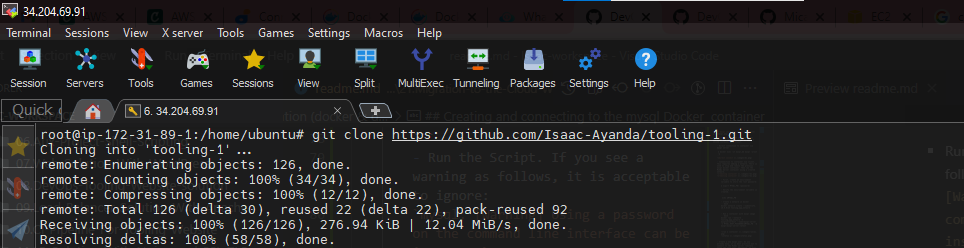
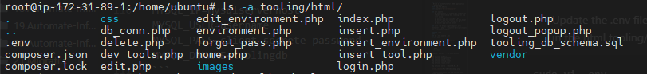

# Migration To The Сloud With Containerization (docker & docker-compose).


## Install Docker

```bash
$ sudo apt update

$ sudo apt install apt-transport-https ca-certificates curl software-properties-common

$ curl -fsSL https://download.docker.com/linux/ubuntu/gpg | sudo apt-key add -

$ sudo add-apt-repository "deb [arch=amd64] https://download.docker.com/linux/ubuntu focal stable"

$ sudo apt install docker-ce

# to add docker to sudo group
$ sudo usermod -aG docker ${USER}
```

## Creating and connecting to the mysql Docker  container


- Pull mysql image from docker
```bash
$ docker pull mysql/mysql-server:latest
```
- Run a container from this image and setup the mysqldb environment variables


```bash
$ docker run --name <container_name> -e MYSQL_ROOT_PASSWORD=<my-secret-pw> -d mysql/mysql-server:latest

```


- Connection can be made directly to the container via the mysql server or using a second container as a client.

	- Direct connection to container via mysql server
	```
	 $ docker exec -it mysql_db mysql -uroot -p
	```
	

	- Connnection to container via client. This requires adding a network. There is need to stop and remove the previous mysql docker container. Then run the MySQL Server container using a created network.
	
	

		- First, create an environment variable to store the root password: 
		```
		$ export MYSQL_PW= <password>
		```
		- Verify the environment variable is created.

		```
		 $ echo $MYSQL_PW
		```
		- Create a network to serve as a driver bridge.
		```docker network create --subnet=172.18.0.0/24 tooling_app_network 

		```
		- To setup a mysql client container and connection to the mysql-server via the mysqlserverhost connection, pull the image and run the container with all of the following command:
		```
		 $ docker run --network tooling_app_network -h mysqlserverhost --name=mysql-server -e MYSQL_ROOT_PASSWORD=$MYSQL_PW  -d mysql/mysql-server:latest 
		```
		

	

		- Access through the client mysql container by running the following command:

		```bash
		$ docker run --network tooling_app_network --name mysql-client -it --rm mysql mysql -h mysql-server -uisaac -p$MYSQL_PW
		```
		
		

	- Create a new mysql user: As you already know, it is best practice not to connect to the MySQL server remotely using the root user. Therefore, we will create an SQL script that will create a user we can use to connect remotely.

		- Create a file and name it create_user.sql and add the below code in the file:

		```
		$ CREATE USER 'isaac'@'%' IDENTIFIED BY 'password'; GRANT ALL PRIVILEGES ON * . * TO 'isaac'@'%';
		```
		- Run the Script. If you see a warning as follows, it is acceptable to ignore:
		`mysql: [Warning] Using a password on the command line interface can be insecure.`
 
		```
		docker exec -i mysql-server mysql -uroot -p$MYSQL_PW < create_user.sql
		```
		

## Creating database schema & integration

- Clone the Tooling App
```bash
git clone https://github.com/Isaac-Ayanda/tooling-1.git
```

- Populate the database with the tooling users from the terminal and export the location of the SQL file. Verify that the path is exported:
 ```bash
$ export tooling_db_schema=tooling/html/tooling_db_schema.sql

$ docker exec -i mysql-server mysql -uroot -p$MYSQL_PW < $tooling_db_schema
 ```



- Update the .env file with connection details to the database. The .env file is located in the html tooling/html/.env folder but not visible in terminal. MYSQL_IP=mysqlserverhost; MYSQL_USER=username; MYSQL_PASS=client-secrete-password; MYSQL_DBNAME=toolingdb

```
$ sudo vi .env

MYSQL_IP=mysqlserverhost MYSQL_USER=username MYSQL_PASS=client-secrete-password MYSQL_DBNAME=toolingdb
```



- Build the tooling app image
```bash
$ docker build -t tooling:0.0.1 .
```


- Run the container
```bash
$ docker run --network tooling_app_network -p 8085:80 -it tooling:0.0.1
```

[ ](./images/lh2.png)
[ ](./images/error.png)


## Practice Task 1

### Part 1
- Write a Dockerfile for TODO application
```dockerfile
FROM php:7.4-cli
LABEL author="Isaac"

RUN apt update \
	&& apt install -y libpng-dev zlib1g-dev libxml2-dev libzip-dev libonig-dev zip curl unzip \
	&& docker-php-ext-configure gd \
	&& docker-php-ext-install pdo pdo_mysql sockets mysqli zip -j$(nproc) gd \
	&& docker-php-source delete

RUN curl -sS https://getcomposer.org/installer | php -- --install-dir=/usr/local/bin --filename=composer

WORKDIR /app
COPY . .
RUN mv .env.sample .env
EXPOSE 8000

ENTRYPOINT [ "sh", "serve.sh" ]
```

> Content of serve.sh

```bash
#!/bin/bash

composer install  --no-interaction

php artisan migrate
php artisan key:generate
php artisan cache:clear
php artisan config:clear
php artisan route:clear

php artisan serve  --host=0.0.0.0
```


- Run both database and app on the same docker network

```bash
docker network create --subnet=172.17.0.0/24 tooling_app_network

docker run --network tooling_app_network -p 8085:8000 -it todo-app:0.0.2
```


- Access the application from the browser


### Part 2
- Create an account on Dockerhub
- Create a new Docker repository 
- Push the docker image to the repository
```bash
docker login

docker build -t zik777/todo_app:0.0.1 .

docker push zik777/todo_app:0.0.1
```


### Part 3
- Write a Jenkinsfile that will simulate Docker build and Docker push to the repository

```groovy
pipeline {
    agent any

	environment {
		DOCKERHUB_CREDENTIALS=credentials('dockerhub')
	}
	
	stages {
		stage("Initial cleanup") {
			steps {
				dir("${WORKSPACE}") {
					deleteDir()
				}
			}
		}

    	stage('Clone Github Repo') {
      		steps {
            	git branch: 'todo-app-updated', url: 'https://github.com/Isaac-Ayanda/php-todo.git'
      		}
    	}

		stage ('Build Docker Image') {
			steps {
				script {
					sh 'docker build -t zik777/todo-app:${BRANCH_NAME}-${BUILD_NUMBER} .'
				}
			}
		}

		stage ('Push Image To Docker Hub') {
			steps {
				script {
					sh 'echo $DOCKERHUB_CREDENTIALS_PSW | docker login -u $DOCKERHUB_CREDENTIALS_USR --password-stdin'

					sh 'docker push yheancarh/php_todo:${BRANCH_NAME}-${BUILD_NUMBER}'
				}
			}
		}

		stage('Cleanup') {
			steps {
				cleanWs(cleanWhenAborted: true, cleanWhenFailure: true, cleanWhenNotBuilt: true, cleanWhenUnstable: true, deleteDirs: true)
				
				sh 'docker logout'

				sh 'docker system prune -f'
			}
		}
  	}
}
```

- Connect the repo to Jenkins

- Create a multibranch pipeline


- Simulate a CI pipeline from a feature and master using previously created Jenkinsfile


- Verify that the images pushed from the CI can be found at the registry


## Deployment with docker-compose
- Create a file name it ```tooling.yaml```

```yml
version: "3.9"

services:
  
  tooling_frontend:
    build: .
    ports:
      - "5000:80"
    volumes:
      - tooling_frontend:/var/www/html
    links:
      - db

  db:
    image: mysql
    restart: always
    environment:
      MYSQL_DATABASE: toolingdb
      MYSQL_USER: admin
      MYSQL_PASSWORD: password
      MYSQL_RANDOM_ROOT_PASSWORD: '1'
    volumes:
      - db:/var/lib/mysql

volumes:
  tooling_frontend:
  db:
```


- Write a Jenkinsfile to test before pushing to dockerhub

```groovy
stage ('Test Endpoint') {
	steps {
		script {
			while (true) {
				def res = httpRequest 'http://localhost:5000'
			}
		}
	}
}

stage ('Push Image To Docker Hub') {
	when { expression { res.status == 200 } }
	steps {
		script {
			sh 'echo $DOCKERHUB_CREDENTIALS_PSW | docker login -u $DOCKERHUB_CREDENTIALS_USR --password-stdin'

			sh 'docker push yheancarh/php_todo:${BRANCH_NAME}-${BUILD_NUMBER}'
		}
	}
}
```

<!-- ![] -->

<!-- ## Practice Task 2 -->

<!-- - version: Specifies the version of the docker-compose
- services: defines the conatiners to start when docker-dompose is run
- build: defines the Dockerfile to start a service
- ports: attaches port to the container
- volumes: attaches a path on the host instance to the container
- links: connect the container to another
- image: defines the docker image to use for the container
- restart: tells the container how or when to restart
- environment: used to pass variables to the service running in the service -->
